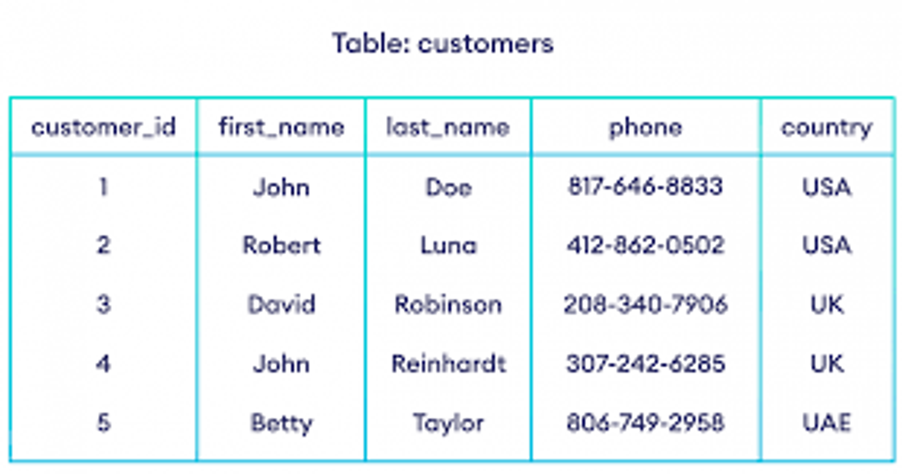
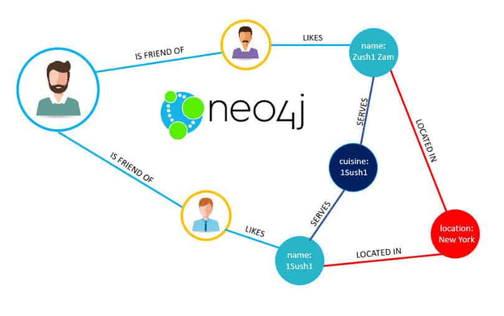
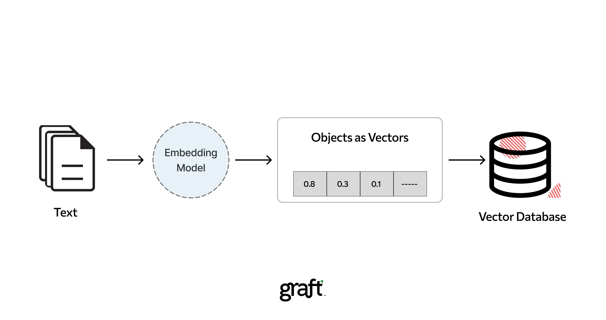
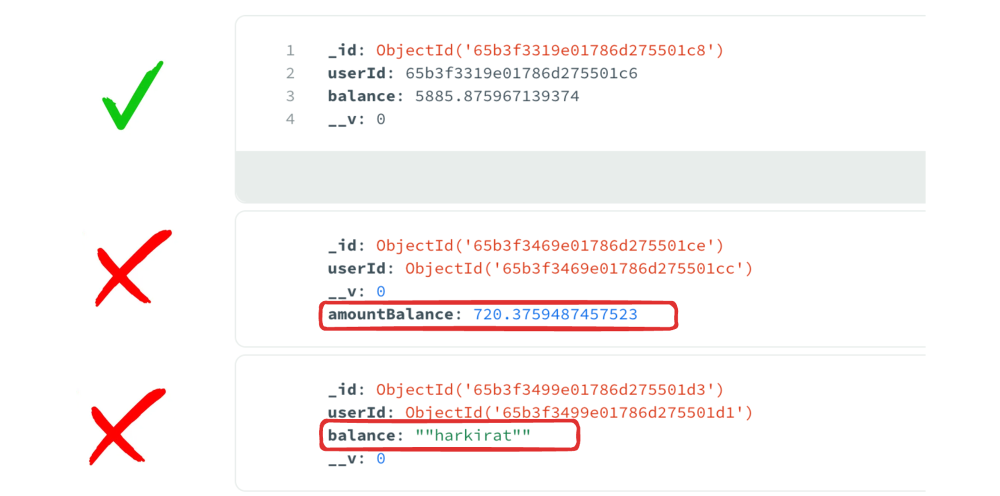

# Week 10.1 Cohort 2 Postgres

### Types of Databases
- Databases are divided into 2 types -
    1. SQL - Structured Query Language
        - SQL databases, also known as **relational databases**, are a type of **database management system (DBMS)** that organizes and stores data in a structured format using **tables**, **rows**, and **columns**. 
        - They have a strict schema.
        - They are very hard to change schemas, and involves migrations
        
    2. NoSQL - 
        - NoSQL databases, as the name implies, are databases that depart from the traditional relational model and do not necessarily use SQL as their primary query language.
        - These databases are designed to handle various types of unstructured, semi-structured, or highly distributed data at scale.
        - They are schemaless databases.
        - They are faster to produce apps.
        
    3. Graph Databases -
        - Data is stored in the form of a graph.
        - Specially useful in cases where relationships need to be stored (social networks).
        - Examples - Neo4j
        
    4. Vector Databases - 
        - Stores data in the form of vectors.
        - Useful in Machine learning
        - Examples - Pinecone
        

### Why not NoSQL?
- NoSQL databases like MongoDB, has a schemaless properties makes it ideal for bootstraping a project fast. But as the app grows this property makes it very easy for data to get corrupted.  
#### What is schemaless?
- Schemaless means different rows can have different schema (keys/types).

- This could leads to problems such as - 
    - inconsistency in databases
    - can cause run time errors
    - make it too flexible for an app that needs strictness
- This has also few upsides like - 
    - can move data very fast
    - can change schema very easily

### Why SQL?
- SQL databases have a strict schema. 
- They require us to -
    - Define our schema
    - Put in data that follows that schema
    - Update the schema as our app changes and perform migrations.
- There are 4 parts when using an SQL database - 
    - Running the database.
    - Using a library that let’s you connect and put data in it.
    - Creating a table and defining it’s schema.
    - Run queries on the database to interact with the data (Insert/Update/Delete). 