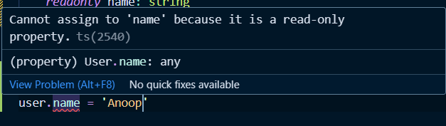

# Week 12.2 | Advance Typescript APIs

## Contents:
- [**Pre-requisities**](#pre-requisities)
    - [**Interface**](#interface)
    - [**Type**](#type)
    - [**Recap setup procedure**](#recap-setup-procedure)
- [**Pick**](#pick)
- [**Partial**](#partial)
- [**Readonly**](#readonly)
- [**Record and Map**](#record-and-map)
  - [**Record**](#record)
  - [**Map**](#map)
- [**Exclude**](#exclude)

### Pre-requisities
#### Interface
- In TypeScript, an interface is a way to define the structure of an object.
- It's a TypeScript-specific feature that helps in describing the shape of objects, including their properties and methods.
- Interfaces are purely a compile-time construct and do not generate any JavaScript code.
- example: Here, is a user object looks like 

```ts
interface User {
	name: string
	age: number
}

function sumOfAge(user1: User, user2: User) {
	return user1.age + user2.age
}

const age = sumOfAge({ name: 'Taro', age: 20 }, { name: 'Jiro', age: 30 })
console.log(age)
```

#### Type
- In TypeScript, types allow us to aggregate data together in a manner very similar to interfaces. They provide a way to define the structure of an object, similar to how interfaces do.
```ts
type User = {
  firstName: string;
	lastName: string;
	age: number
}
```
#### Recap setup procedure
to start a typescript project locally, please do the following:
1. Initialize TS
```bash
npx tsc --init
```
2. Change tsconfig as per your needs. Usually changing rootDir and outDir is a good idea
```json
{
	"rootDir": "./src",
	"outDir": "./dist"
}
```

### Pick
- **Pick** allows us to create a new type by selecting a set of properties (**Keys**) from an existing type (**Type**).
- Imagine we have a User model with several properties, but for a user profile display, we only need a subset of these properties.
```ts
interface User {
  id: number;
  name: string;
  email: string;
  createdAt: Date;
}

// For a profile display, only pick `name` and `email`
type UserProfile = Pick<User, 'name' | 'email'>;

const displayUserProfile = (user: UserProfile) => {
  console.log(`Name: ${user.name}, Email: ${user.email}`);
};
```
- This will also ensure that if the type of any key in **User** type changes, those changes will be reflect back to **UserProfile**.

### Partial
- **Partial** makes all properties of a type optional, creating a type with the same properties, but each marked as optional.

```ts
interface User {
  id: number;
  name: string;
  email: string;
  createdAt: Date;
}

type UserProfile = Pick<User, 'name' | 'email'>;
type UserProfileUpdate = Partial<UserProfile>

const updateUserProfile = (user: UserProfileUpdate) => {
    // hit the database tp update thr user.
};

updateUserProfile({})
```

### Readonly
- When we have a configuration object that should not be altered after initialization, making it **Readonly** ensures its properties cannot be changed.
```js
const obj = {
  name: 'Anoop'
  age: 23
}
const arr = [1,2,3,4]
```
- In the about code we cannot change the value of **obj** and **arr*, but we can change the value inside the both.
```js
obj.name = 'Harkirat'
arr[2] = 10
```
- Suppose we want to ensures its properties cannot be changed, that as where **Readonly** comes to the rescue.
```ts
interface User {
	readonly name: string
	readonly age: number
}
```
- By enforcing **readonly**, we can't change the the value of **name** or **age** of a user.

- Suppose we already have a type which we need to make readonly then we could do like this
```ts
interface User {
	name: string
	age: number
}

const user: Readonly<User> = { name: 'Taro', age: 20 }
```
- Readonly is used when we want to ensure the even the inner values must be const.
- **Note:** This is compile time checking, not runtime (unlike const).

### Record and Map
#### Record
```ts
type User = {
	id: string
	username: string
}
  
type Users = {
	[key: string]: User
}
  
const users: Users = {
	'ras@rtti': {
	  id: 'ras@rtti',
	  username: 'anoop'
	},
	'ras@harki': {
		id: 'ras@harki',
		username: 'harkirat'
	},
}
```
- We could use the above approach to give type to objects, but **record** lets us do in a cleaner way.
```ts
type User = {
	id: string
	username: string
}

type Users = Record<string, User>

const users: Users = {
	'ras@rtti': {
	  id: 'ras@rtti',
	  username: 'anoop'
	},
	'ras@harki': {
		id: 'ras@harki',
		username: 'harkirat'
	},
}

console.log(users['ras@rtti']); 
```
- **Note:** **Record** is typescript feature not a javascript feature.

#### Map
- **Maps** gives us an even fancier way to deal with objects. 
- Very similar to **Maps** in C++.

```ts
type User = {
	id: string
	username: string
}

const users = new Map<string, User>()

users.set('ras@rtti', { id: 'ras@rtti', username: 'anoop' })
users.set('ras@harki', { id: 'ras@harki', username: 'harkirat' })

const user = users.get('ras@rtti')
console.log(user)
```

### Exclude
- In a function that can accept serveral types of inputs but we want to exclude specific types from being passed to it.
```ts
type EventType = 'click' | 'scroll' | 'mousemove'
type ExcludeEvent = Exclude<EventType, 'scroll'>

const handleEvent = (event: ExcludeEvent) => {
	console.log(`Handling event: ${event}`);
}

handleEvent('click')
```
