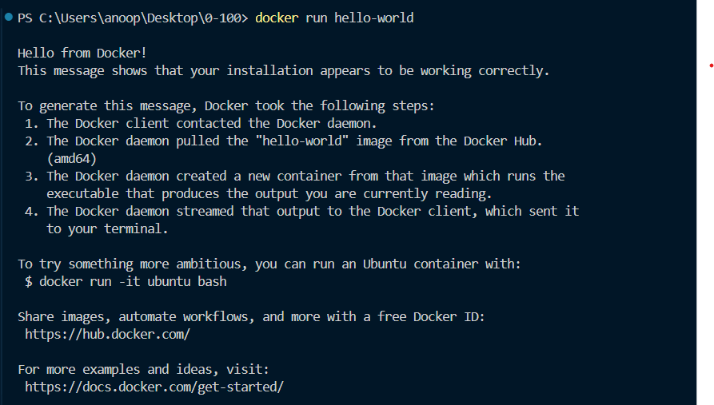
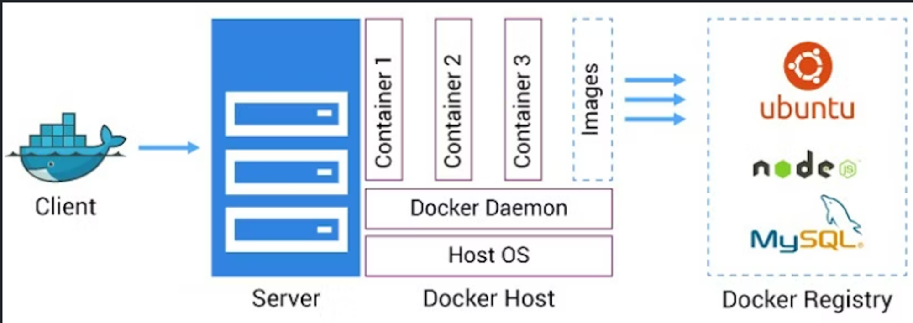

# Week 12.3 | Actionable Docker

`Note`: This a short actionable introduction to Docker. This will help us get started with running packages locally and gives us a taste of what Docker can do.

## Contents:
- [**Installation**](#installation)
- [**Verification**](#verification)
- [**Why Docker?**](#why-docker)

### Installation
Docker can be installed using the Docker GUI, which simplifies the setup process. Detailed instructions for various operating systems can be found on the official Docker documentation website at https://docs.docker.com/engine/install/.

### Verification 
After installation, we should verify that Docker is installed correctly by running the `docker run hello-world` command. This command will pull the "hello-world" image from Docker Hub and run it in a new container, which should print a message to the terminal.

### Why Docker?
Docker is a powerful platform that serves several purposes in the development, deployment, and running of applications. Below are the reasons why it is used:
1. **Containerization of Applications:** 
    - Docker allows us to package our application and its dependenices into a container, which is a lightweight, standalone and executable software package.
    - This containerization ensures that the application run consistently across different computing environments from development to staging to production.
2. **Running Other People's Code and Project:**
    - With docker, we can easily run software and applications build by others without worrying about the setting up the required environment or dependenices.
    - This is because all the necessary components are included within the container.
3. **Running Common Software Packages:**
    - Docker provides the ability to run common software packages such as databases(MongoDB, Postgres, etc.) within containers.
    - This means we can quickly deploy and manage these services without the need  to install and configure them directly on out host machine.

**Note:** The use of Docker streamlines the development process, simplifies deployment, and enhances the scalability and portability of applications. It isolates applications in containers, making it easier to manage dependencies and avoid conflicts between different software running on the same system. 