# Week 14.1 | Into to Next.js (Client Side)

## Contents:
- [**Introduction to Next.js**](#introduction-to-nextjs)
- [**Problem with React.js**](#problem-with-reactjs)
- [**SEO Optimisation**](#seo-optimisation)
- [**Waterfalling Problem**](#waterfalling-problem)
- [**Lets bootstrap a simple Next.js App**](#lets-bootstrap-a-simple-nextjs-app)
    - [**File Structure**](#file-structure)
    - [**Bootstrap the project**](#bootstrap-the-project)
- [**Understanding routing in Next**](#understanding-routing-in-next)
- [**Server Side Rendering (SSR)**](#server-side-rendering-ssr)
- [**Layouts**](#layouts)
- [**Layouts in sub routes**](#layouts-in-sub-routes)
- [**Merging Routes**](#merging-routes)

### Introduction to Next.js
**Next.js** is a React framework for building full-stack web applications. 

### Problem with React.js
1. In React Project, we have maintain a seperate repository for backend and has to deploy seperately.
2. React does not provide out of the box routing (We had to use react-router-dom).
3. React is not SEO Optimised
4. Waterfalling Problem

### SEO Optimisation
- Google has a bunch of crawlers that hit websites and figure out what the website does.
- These crawlers ranks the website based on the HTML it gets back.
- The crawlers don't usually run JS code and renders the webpage to see the final output.
- A website build using React.js, initially has a boiler plate HTML, which gets hydrated after the react code gets rendered.
- This isn't suitable for SEO Crawlers, as the HTML they gets is just a boiler plate that does not specific any information regarding the website.
    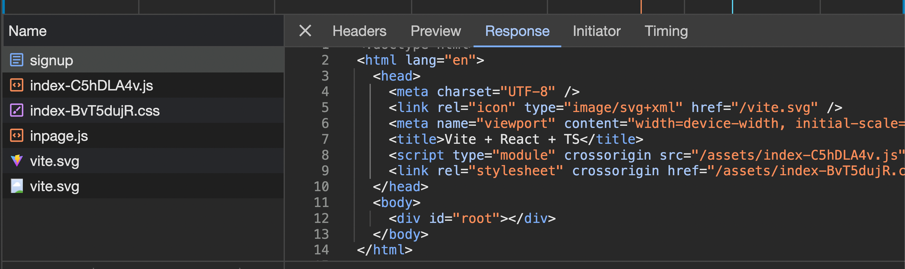
- Thats where Next.js comes into picture, It also Static Site Generation(SSG) and Server Side Rendering(SSR).


### Waterfalling Problem
- The **waterfalling problem** in React, and more broadly in web development, refers to a scenario where data fetching operations are chained or dependent on each other in a way that leads to inefficient loading behavior.
- Lets assume we build a Blogging website in React
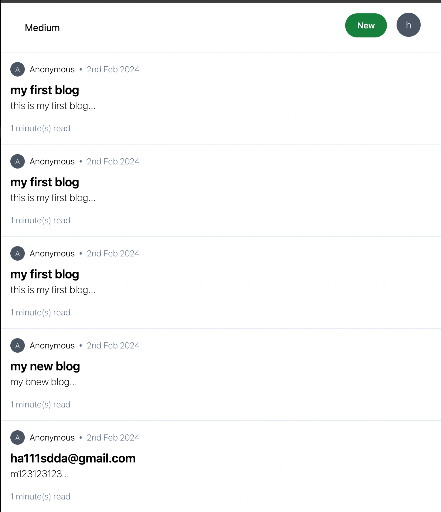
- Lets look at the request cycle -
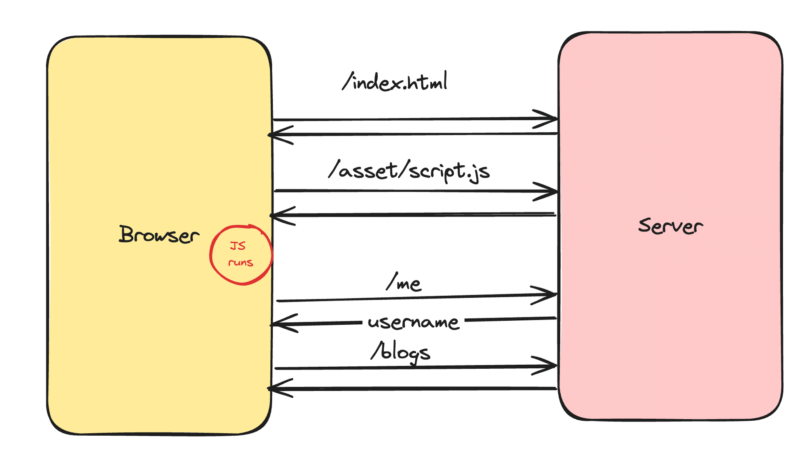
    1. Fetching the index.html from the CDN
    2. Fetching script.js from CDN
    3. Checking if user is logged in (if not, redirect them to /login page)
    4. Fetching the actual blogs
- There are 4 round trips that happen one after the other (sequentially).
- Let see how next.js handles the above request -
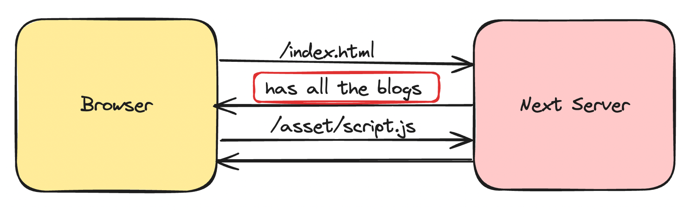
- Next.js lets us get all the blogs in one request, this is great as it better for SEO optimization.

### Next.js Offerings
Next.js provides us the following upsides over React:
1. Server Side Rendering (SSR) - It solves the SEO problem.
2. API routes - Single Codebase with frontend and backend.
3. File Based Routing - Next.js out of the box comes with routing.
4. Bundle Size Optimizations
5. Static Site Generation (SSG)
6. Maintained by the Vercel Team

Downsides:
1. Next.js website can not be distributed via a CDN, always needs a server running that does Server Side Rendering and is expensive.
2. Very opinionated, very hard to move out of it

### Lets bootstrap a simple Next.js App

```bash
npx create-next-app@latest
```
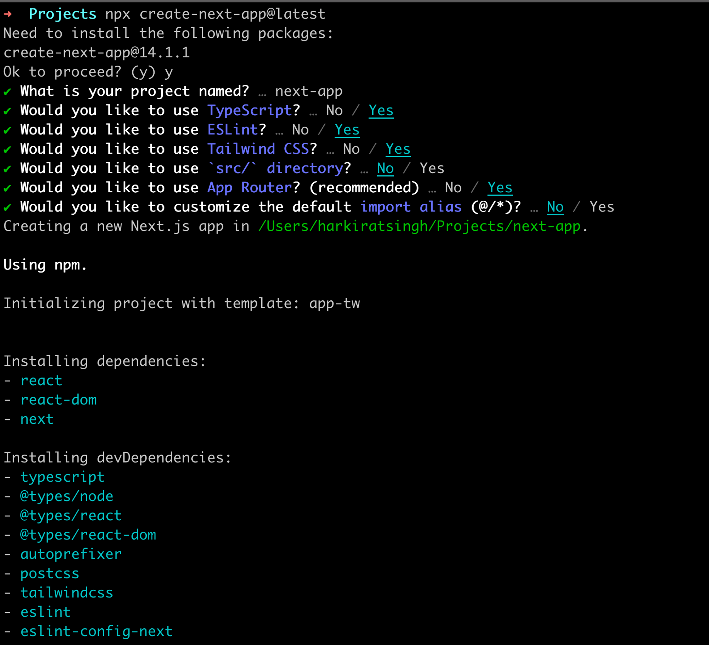

#### File Structure

1. **next.config.mjs** - Nextjs configuration file
2. **tailwind.config.js** - Tailwind configuration file
3. **app** - Contains all your code/components/layouts/routes/apis

#### Bootstrap the project
1. Remove everything from **app/page.tsx** and return an empty **div**.
2. Remove the css bits (not the tailwind headers) from the **global.css** file.

### Understanding routing in Next
- **Routing in react:**
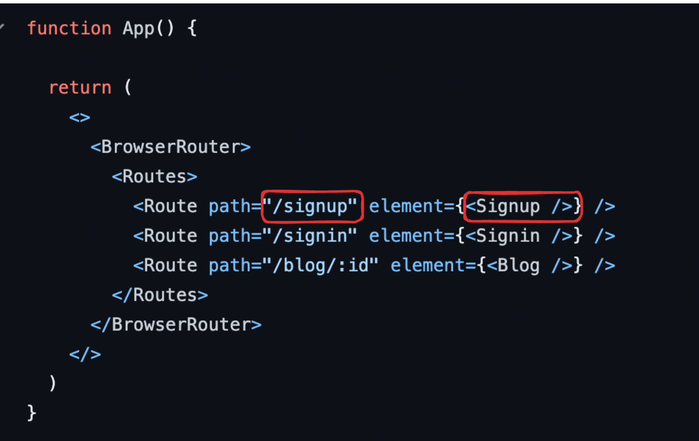
- **Routing in Next.js:**
    - **Next.js** has a **file based router**, this means that the way we create our files, describes what renders on a route.
    - Let’s add a new folder in app called **signup**.
    - Let’s add a file called page.tsx inside **app/signup**.
        ```tsx
        export default function Signup() {
            return (
            <div>
                hi from the signup page
            </div>
            );
        }
        ```
    - Start the application locally
        ```bash
        npm run dev
        ```
        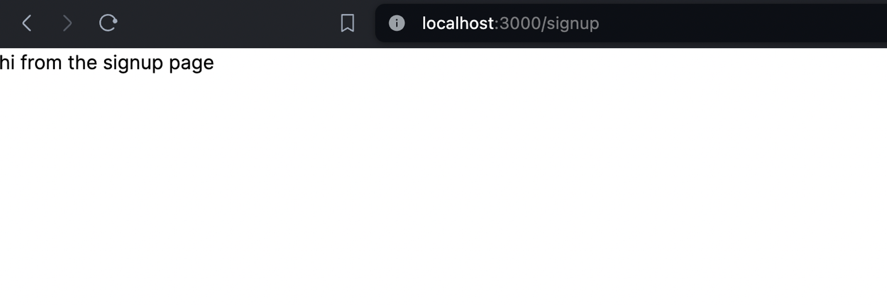
    - Final folder structure
    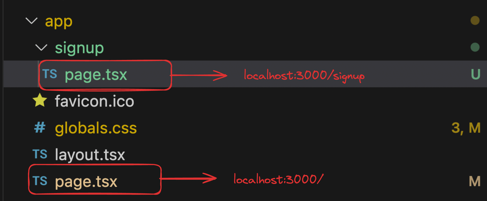

### Server Side Rendering (SSR)
- **Server Side Rendering (SSR)** in Next.js allows you to render React components on the server side before sending them to the client.
- This can improve performance, especially for **search engine optimization (SEO)** and initial page load times.
- However, it's important to consider the trade-offs, such as increased server load and latency due to rendering on every request.
    
- Now if **GoogleBot** tries to scrape the page, it’ll understand that this is a **signup page** without running any Javascript.
- The first **index.html** file it get’s back will have context about the page since it was **server side rendered**.

### Layouts
- A layout is UI that is shared between multiple routes.
- On navigation, layouts preserve state, remain interactive, and do not re-render. 
    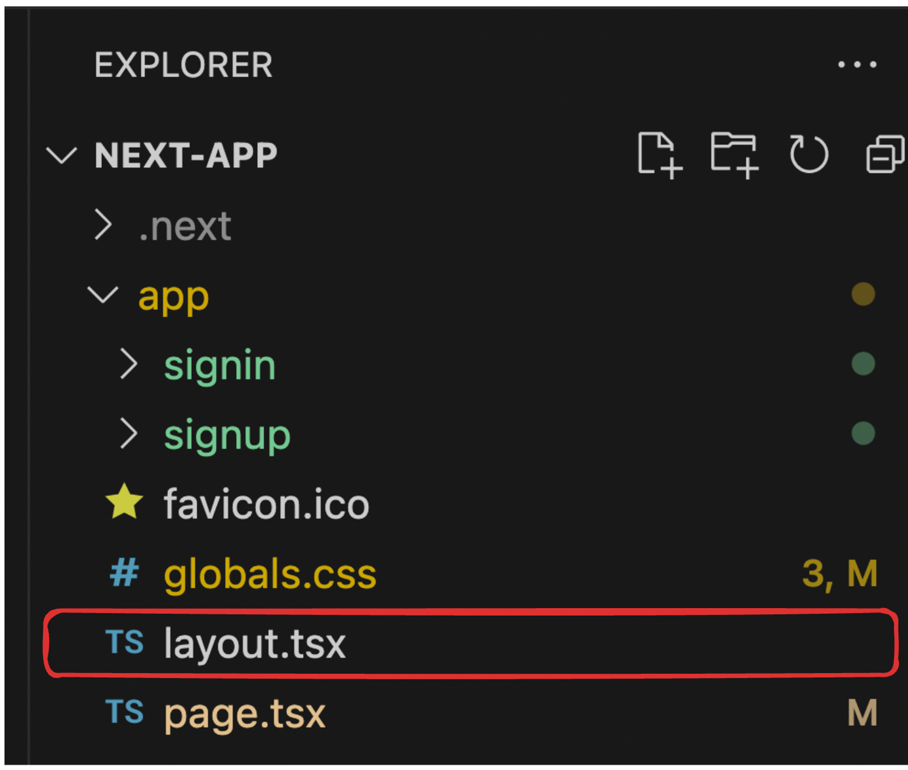
- Lets explore **layout.tsx**
    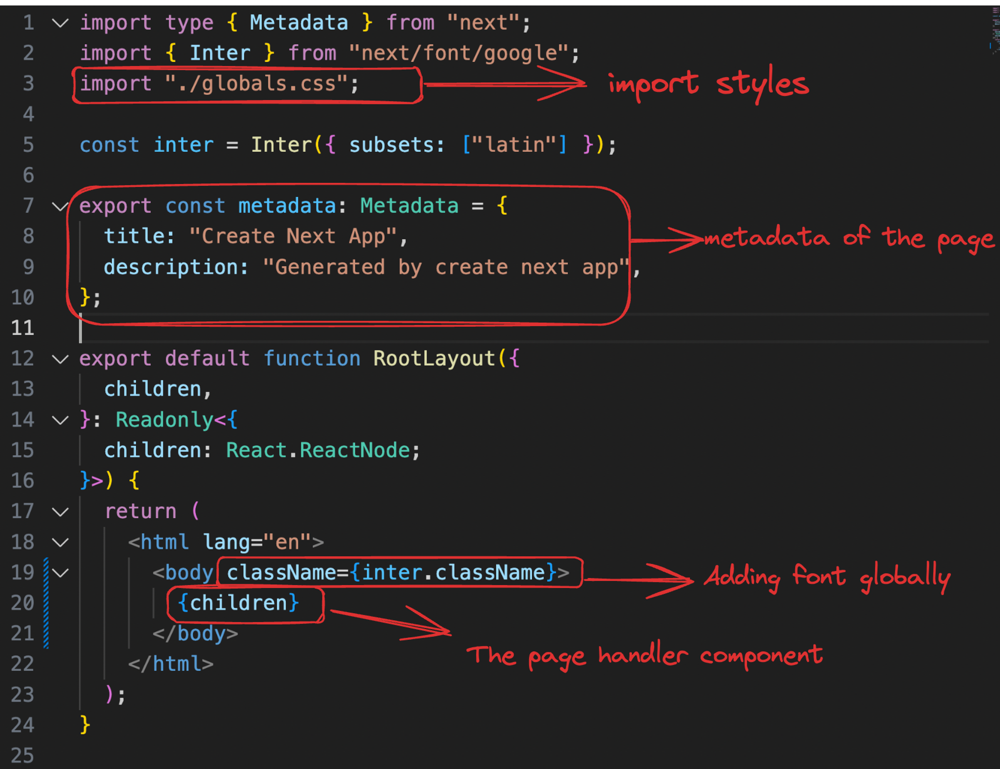

### Layouts in sub routes
- We could add additional layouts to the sub routes which won't be applied outside that particular route.
- Let say we need to a banner in /signin route only that says **Login now to get 20% OFF**.
- We would need to create a **layout.tsx** inside the **signin** folder.
    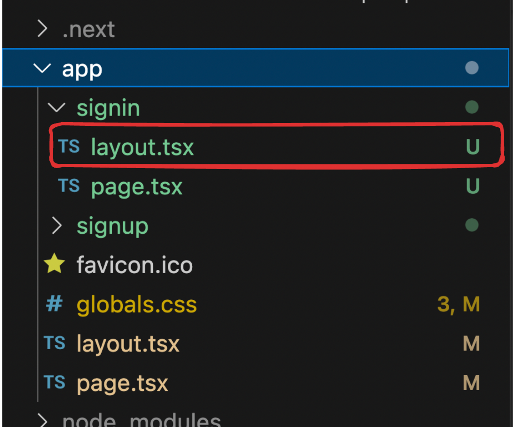
    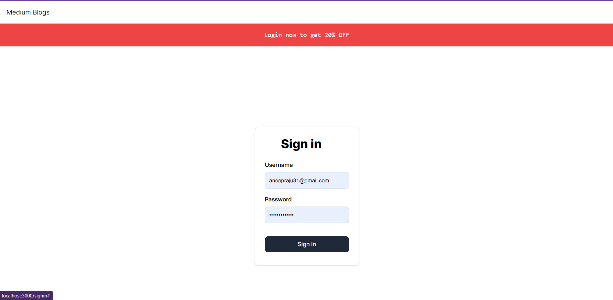
- By default, layouts in the folder hierarchy are **nested**, which means they wrap child layouts via their **children** prop. 
- we can nest layouts by adding **layout.tsx** inside specific route segments (folders).

### Merging Routes
- Suppose we want to get to **banner** in both **sign in** and **sign up** page.
- We could go for any of these approaches:
    1. **Approach #1**: Move both the **signin** and **signup** folder inside a another folder let say **auth**. Inside which we will have a **layout.tsx** 
        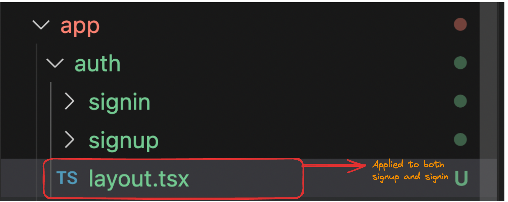
        - we can access the routes at - 
            - **signin**:  **http://localhost:3000/auth/signin**
            - **signup**: **http://localhost:3000/auth/signup**
    2. **Approach #2**: We can create a new folder with **()** around the name.
        - This folder is ignored by the router.
        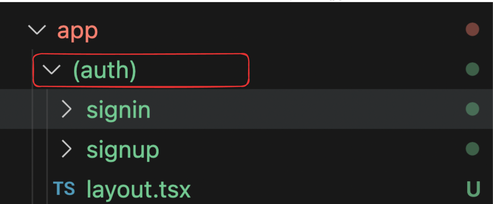
        - We can access the routes at - 
            - **signin**:  **http://localhost:3000/signin**
            - **signup**: **http://localhost:3000/signup**