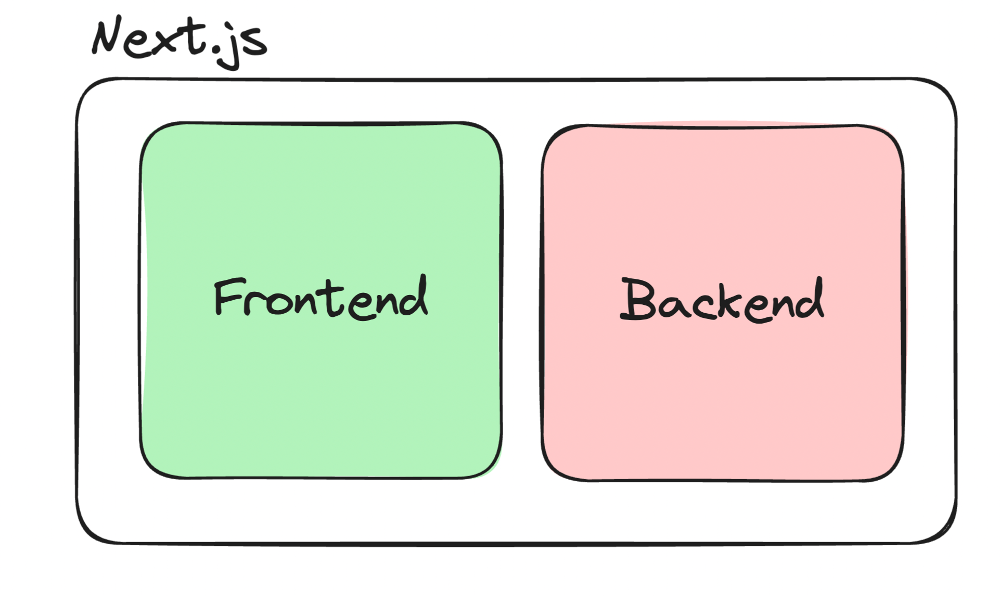
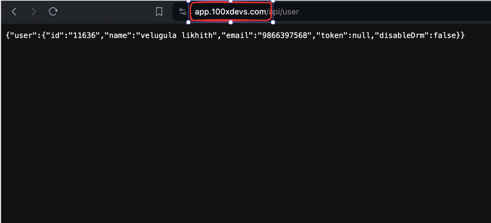
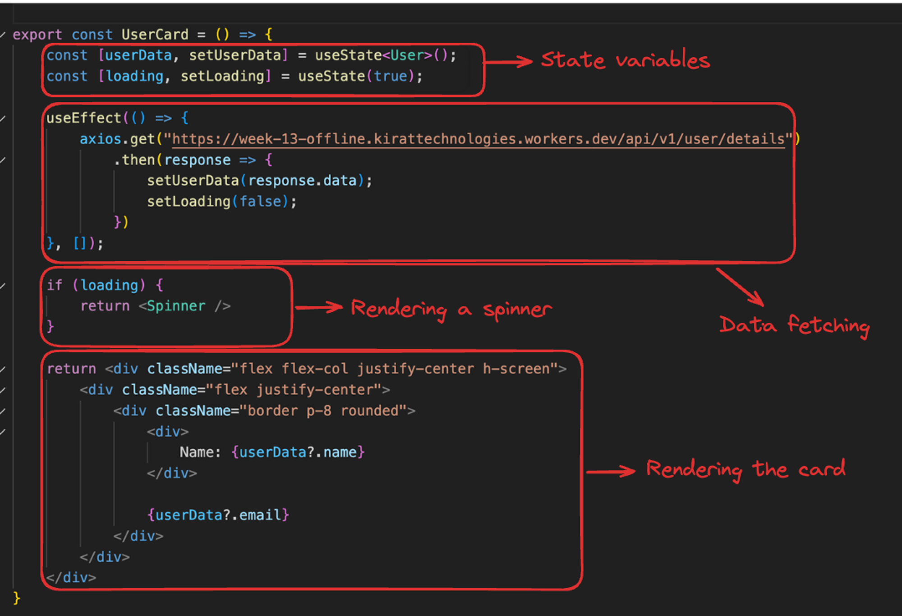
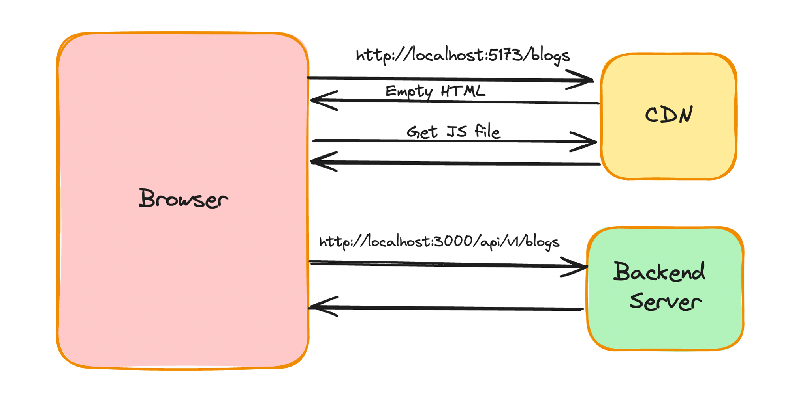
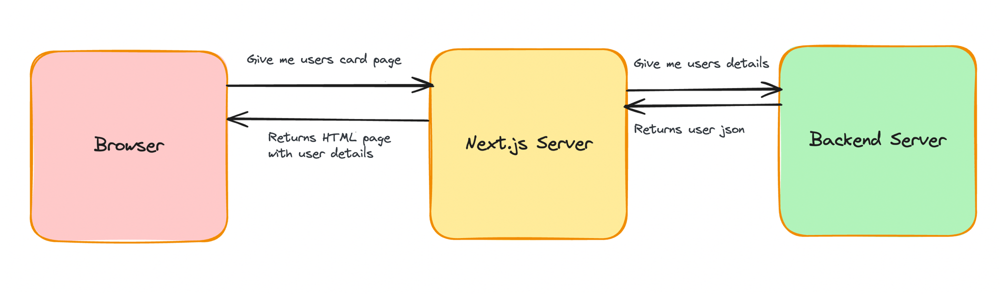
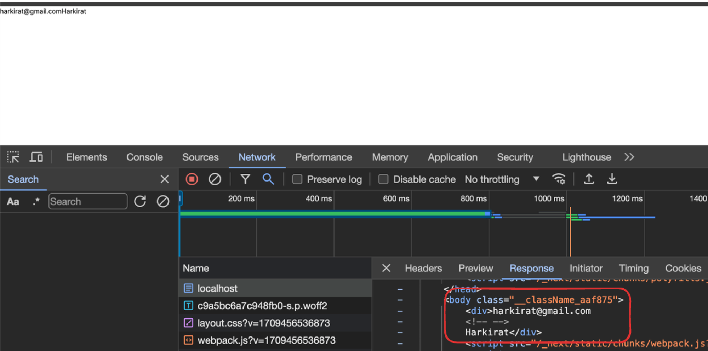

# Week 14.2 | Intro to Next.js (Server Side)

### Contents - 
- [**Backend in Next.js**](#backend-in-nextjs)
- [**Recap of data fetching in React**](#recap-of-data-fetching-in-react)
- [**Data fetching in Next**](#data-fetching-in-next)
    - [**Let try this using next.js**](#let-try-this-using-nextjs)
- [**Loaders in Next**](#loaders-in-next)
- [**Introducing api routes in Next.js**](#introducing-api-routes-in-nextjs)
- [**Let’s move the backend into our own app**](#lets-move-the-backend-into-our-own-app)
- [**Frontend for Signing up**](#frontend-for-signing-up)


### Backend in Next.js
- Next.js is a full stack framework.
    
- This means the same server handles the frontend and backend request.
    
    
- Next.js allows us to maintain a single codebase for our application rather than maintaining seperate codebase for frontend and backend which we used to do with MERN.
- This also ensure that there are **no CORS issues**, as same domain name is for both backend and frontend.
- This also makes deployment easier, we only have to deploy a single codebase, where as on MERN, we have to deploy both frontend and backend seperately.


### Recap of data fetching in React
- This is a card website that let's a user see their name and email from the given endpoint.
    
- Now lets look at the UserCard component -
    
- Now see how to data fetching is happening on the client
    
    - First we send a request to the endpoint and get backs an empty HTML.
    - Second request is send to get the JS scripts.
    - Then the UserCard component get rendered initial with a spinner and backend request is send to the server to fetch the user details.
    - After fetching the user details it gets rendered on the client side.

### Data fetching in Next
- We could do the same way we did in React to fetch data, but we will lose the benefits of **Server Side Rendering** that Next.js offers us.
- In SSR, the user details are fetched on the server side and pre-render on the page before returning it to the client.
    

#### Let try this using next.js
1. Initialise an empty next project
    ```bash
    npx create-next-app@latest
    ```

2. Install **axios**
    ```bash
    npm i axios
    ```
3. Clean up **page.tsx**, **global.css**.
4. In the root **page.tsx**, write a function to fetch the user details
    ```js
    async function getUserDetails() {
        const response = await axios.get("https://week-13-offline.kirattechnologies.workers.dev/api/v1/user/details")
        return response.data;
    }
    ```
5. Convert the default export to be an async function (yes, nextjs now supports **async components**).
    ```jsx
    import axios from "axios";

    async function getUserDetails() {
        const response = await axios.get("https://week-13-offline.kirattechnologies.workers.dev/api/v1/user/details")
        return response.data;
    }

    export default async function Home() {
        const userData = await getUserDetails();

        return (
            <div>
                {userData.email}
                {userData.name}
            </div>
        );
    }
    ```
6. Check the network tab, make sure there is no waterfalling.
    
7. Prettify the UI
    ```jsx
    import axios from "axios";

    async function getUserDetails() {
        const response = await axios.get("https://week-13-offline.kirattechnologies.workers.dev/api/v1/user/details")
        return response.data;
    }

    export default async function Home() {
        const userData = await getUserDetails();

        return (
            <div className="flex flex-col justify-center h-screen">
                <div className="flex justify-center">
                    <div className="border p-8 rounded">
                        <div>
                            Name: {userData?.name}
                        </div>
                    
                        {userData?.email}
                    </div>
                </div>
            </div>
        );
    }
    ```

### Loaders in Next
Suppose, the **getUserDetails** call takes 5s to finish(lets sata the backend is slow). then the website will take more than 5s seconds to load on client side.
During this time we could show a loader.
```jsx
import axios from "axios";

async function getUserDetails() {
    await new Promise(r => setTimeout(r, 5000))
    const response = await axios.get("https://week-13-offline.kirattechnologies.workers.dev/api/v1/user/details")
    return response.data;
}

export default async function Home() {
    const userData = await getUserDetails();

    return (
        <div className="flex flex-col justify-center h-screen">
            <div className="flex justify-center">
                <div className="border p-8 rounded">
                    <div>
                        Name: {userData?.name}
                    </div>
                
                    {userData?.email}
                </div>
            </div>
        </div>
    );
}
```
Here we have added an artifical delay of 5s.
To add a loader or skeleton in next.js, Just like **page.tsx** and **layout.tsx** , we can define a **loading.tsx** file that will render until all the async operations finish.
```jsx
export default function Loading() {
    return (
        <div className="flex flex-col justify-center h-screen">
            <div className="flex justify-center">
                Loading...
            </div>
        </div>
    )
}
```

### Introducing api routes in Next.js
- Next.js let us write backend route just like express, this is why Next.js is considerd to be a **full stack framework**.
- The benefits of using next.js for backend includes:
    1. Single repo to maintain both frontend and backend codes.
    2. Next.js provides all the standard thing the we get from a backend framework like express.
    3. Server components can directly talk to the backend.

### Let’s move the backend into our own app
Here for the sake of simplicity, we will be returning a hardcoded value for the user's details (email, name).
1. Add a new folder called **api** inside the **app** folder.
2. Add another folder called **user** inside the **api** folder.
3. Add a file inside the**user** folder called **route.js**
4. Initialize a GET route inside the **route.js**
    ```js
    export async function GET() {
        return Response.json({ 
            username: "harkirat", 
            email: "harkirat@gmail.com" 
        })
    }
    ```
5. Try replacing the api call in page.tsx to hit this URL
    ```jsx
    async function getUserDetails() {
        try {
            const response = await axios.get("http://localhost:3000/api/user")
            return response.data;
        }  catch(e) {
            console.log(e);
        }
    }
    ```
    **Note:** This isn’t the best way to fetch data from the backend. We’ll make this better as time goes by


### Frontend for Signing up
1. Create **app/signup/page.jsx**
2. Create a simple Page
    ```jsx
    import { Signup } from "@/components/Signup"

    export default function() {
        return <Signup />
    }
    ```
3. Create **components/Signup.tsx**
    ```jsx
    import axios from "axios";
    import { useState } from "react";

    export function Signup() {
        const [username, setUsername] = useState("");
        const [password, setPassword] = useState("");

        return (
            <div className="h-screen flex justify-center flex-col">
                <div className="flex justify-center">
                    <a href="#" className="block max-w-sm p-6 bg-white border border-gray-200 rounded-lg shadow hover:bg-gray-100 ">
                        <div>
                            <div className="px-10">
                                <div className="text-3xl font-extrabold">
                                    Sign up
                                </div>
                            </div>
                    
                            <div className="pt-2">
                                <LabelledInput 
                                    onChange={(e) => {
                                        setUsername(e.target.value);
                                    }} 
                                    label="Username" 
                                    placeholder="harkirat@gmail.com" 
                                />
                                <LabelledInput 
                                    onChange={(e) => {
                                        setPassword(e.target.value)
                                    }} 
                                    label="Password" 
                                    type={"password"} 
                                    placeholder="123456" 
                                />
                                <button 
                                    type="button" 
                                    className="mt-8 w-full text-white bg-gray-800 focus:ring-4 focus:ring-gray-300 font-medium rounded-lg text-sm px-5 py-2.5 me-2 mb-2"
                                >
                                    Sign in
                                </button>
                            </div>
                        </div>
                    </a>
                </div>
            </div>
        )

    }

    function LabelledInput({ label, placeholder, type, onChange }) {
        return (
            <div>
                <label className="block mb-2 text-sm text-black font-semibold pt-4">{label}</label>
                <input 
                    onChange={onChange} 
                    type={type || "text"} 
                    id="first_name" 
                    className="bg-gray-50 border border-gray-300 text-gray-900 text-sm rounded-lg focus:ring-blue-500 focus:border-blue-500 block w-full p-2.5" 
                    placeholder={placeholder} 
                    required 
                />
            </div>
        )
    }

    ```
4. Convert components/Signup.tsx to a client component
    ```js
    "use client"
    ```
5. Add a  **onclick handler** that sends a **POST request** to **/user**
    ```jsx
     <button 
        onClick={async () => {
            const response = await axios.post(
                "http://localhost:3000/api/user", 
                {
                    username,
                    password
                }
            );
        }} 
        type="button" 
        className="mt-8 w-full text-white bg-gray-800 focus:ring-4 focus:ring-gray-300 font-medium rounded-lg text-sm px-5 py-2.5 me-2 mb-2"
    >
        Sign in
    </button>
    ```
6. Route the user to landing page if the signup succeeded
    ```jsx
    import axios from "axios";
    import { useRouter } from "next/router";
    import { useState } from "react";

    export function Signup() {
        const [username, setUsername] = useState("");
        const [password, setPassword] = useState("");
        const router = useRouter();

        return (
            <div className="h-screen flex justify-center flex-col">
                <div className="flex justify-center">
                    <a href="#" className="block max-w-sm p-6 bg-white border border-gray-200 rounded-lg shadow hover:bg-gray-100 ">
                        <div>
                            <div className="px-10">
                                <div className="text-3xl font-extrabold"> Sign up </div>
                            </div>
                        
                            <div className="pt-2">
                                <LabelledInput 
                                    onChange={(e) => {
                                        setUsername(e.target.value);
                                    }} 
                                    label="Username" 
                                    placeholder="harkirat@gmail.com" 
                                />
                            
                                <LabelledInput 
                                    onChange={(e) => {
                                        setPassword(e.target.value)
                                    }} 
                                    label="Password" 
                                    type={"password"} 
                                    placeholder="123456" 
                                />
                                
                                <button 
                                    onClick={async () => {
                                        const response = await axios.post(
                                            "http://localhost:3000/api/user", 
                                            {
                                                username,
                                                password
                                            }
                                        );
                                        router.push("/")
                                        }} 
                                        type="button" 
                                        className="mt-8 w-full text-white bg-gray-800 focus:ring-4 focus:ring-gray-300 font-medium rounded-lg text-sm px-5 py-2.5 me-2 mb-2"
                                    >
                                    Sign in
                                </button>
                            </div>
                        </div>
                    </a>
                </div>
            </div>
        )
    }

    function LabelledInput({ label, placeholder, type, onChange }) {
        return (
            <div>
                <label className="block mb-2 text-sm text-black font-semibold pt-4">{label}</label>
                <input 
                    onChange={onChange} 
                    type={type || "text"} 
                    id="first_name" 
                    className="bg-gray-50 border border-gray-300 text-gray-900 text-sm rounded-lg focus:ring-blue-500 focus:border-blue-500 block w-full p-2.5" 
                    placeholder={placeholder} 
                    required 
                />
            </div>
        )
    }
    ```
    **Note:** [Ref useRouter hook](https://nextjs.org/docs/app/building-your-application/routing/linking-and-navigating#userouter-hook)