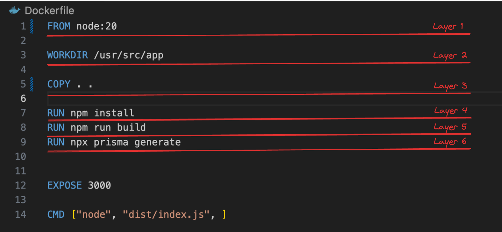
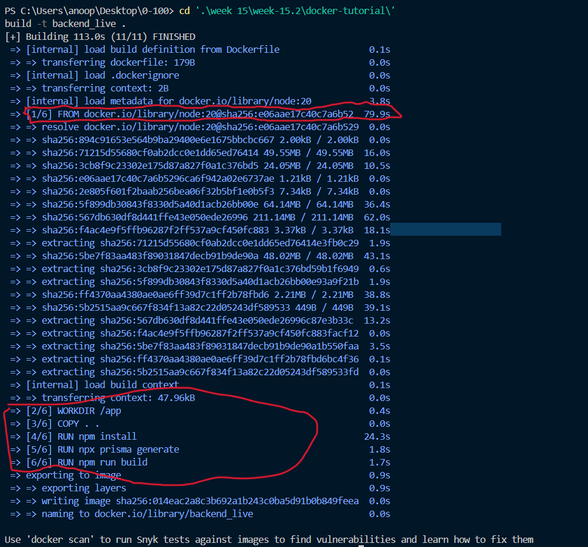
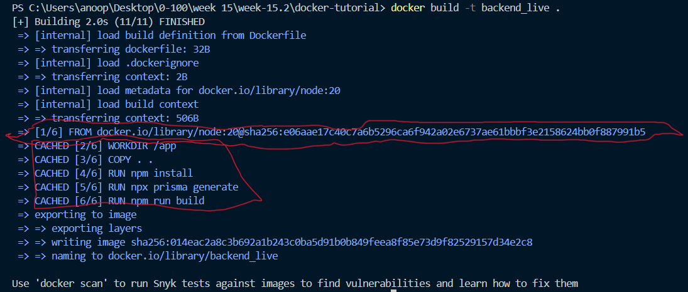

# Week 15.2 - Docker - End to End

### Contents: 
- [**Layers in Docker**](#layers-in-docker)
    - [**How layers are made**](#how-layers-are-made)
- [**Layers practically**](#layers-practically)

### Layers in Docker
In Docker, layers are a fundamental part of the image architecture that allows Docker to be efficient, fast, and portable. A Docker image is essentially built up from a series of layers, each representing a set of differences from the previous layer.

#### How layers are made
1. **Base Layer**: The starting point of an image, tipically an operating system (OS) like Ubuntu, Alpine, or any other base image specified in a Dockerfile.
2. **Instruction Layer**: Each command in a Dockerfile creates a new layer in the image. These include instructions like `RUN`, `COPY` which modify the file sysyem by installing packages, copying files from the host to the container, or making other changes. Each of these modifications created a new layer on top of the base layer.
3. **Reusable & Shared Layers**: Layers are cached and reusable across different images, which makes building and sharing images more efficient. if multiple images are built from the same base image or share common instructions, they can reuse the same layers reducing storage space and speeding up image downloads and builds.
4. **Immutable**: Once a layer is created, it cannot be changed, if a change is made, Docker creates a new layer that captures the difference. This immutablilty is key to Docker's reliability and performance, as unchanged layers can be shared across images and containers.

### Layers practically

