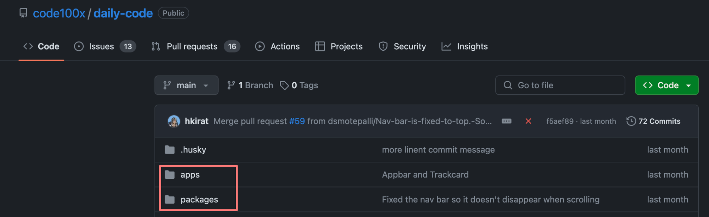
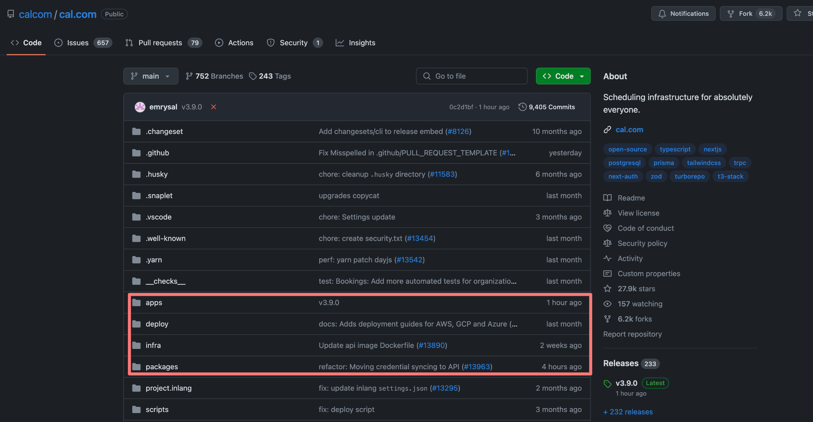
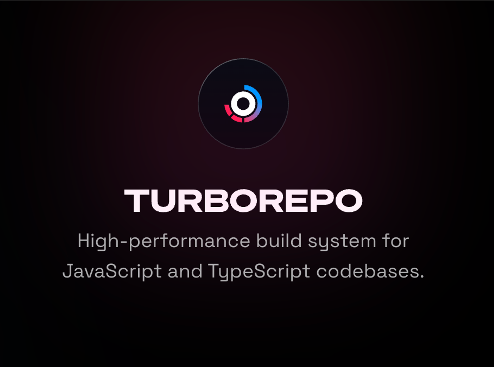

# Week 16.1 | Monorepos

## Contents: 
- [**What are monorepos**](#what-are-monorepos)
- [**Why Monorepos**](#why-monorepos)
- [**Common monorepo framework in Node.js**](#common-monorepo-framework-in-nodejs)
- [**Turborepo**](#turborepo)

### What are monorepos
**Monorepos**, short for **monolithic repositories**, are a type of software development strategy where all source code for multiple projects or components is stored within *a single version control repository*. This is in contrast to the more traditional approach where each project or component is maintained in its own separate repository (often referred to as a "**polyrepo**" approach).

### Why Monorepos
**Monorepos** are chosen by some organizations for various reasons, each with its own set of advantages. Here are some of the key reasons why companies might opt for a monorepo strategy:
1. **Atomic Changes:** Monorepos allow for atomic commits across multiple projects. This means that changes that affect multiple parts of the codebase can be submitted, reviewed, and merged as a single unit, ensuring consistency and reducing the risk of integration issues.
2. **Simplified Code Sharing:** Sharing code between different projects is easier in a monorepo because there's no need to manage and sync multiple repositories. This can lead to more efficient code reuse and a more consistent codebase.
3. **Streamlined Dependency Management:** With all code in one place, it's simpler to manage dependencies between different projects. This can reduce the overhead of maintaining multiple versions of the same dependency and make it easier to enforce consistent use of libraries and frameworks.
4. **Centralized Governance:** A monorepo provides a single point for enforcing coding standards, policies, and best practices. This can lead to a more uniform codebase and can help ensure that all projects adhere to the same quality and security standards.
5. **Enhanced Collaboration:** Monorepos can encourage collaboration across different teams, as it's easier to see how changes in one project might affect others. This can lead to better coordination and a shared sense of ownership of the codebase.
6. **Simplified Refactoring and Large-Scale Changes:** Making large-scale changes across the codebase is more straightforward in a monorepo because all the code is in one place. This can facilitate large refactoring efforts and help keep the codebase modern and maintainable.
7. **Easier Onboarding:** New developers can more easily understand the relationships between different projects and components when they are all stored in a single repository. This can speed up the onboarding process and help new team members become productive more quickly.
8. **Scalable Infrastructure:** Large organizations with the resources to invest in custom tooling can build infrastructure that scales with the size of the monorepo. This includes build systems, CI/CD pipelines, and code review tools that are optimized for handling large volumes of code and frequent changes.
9. **Reduced Duplication:** Monorepos can help reduce duplication of code and effort by making it easier to find existing solutions within the codebase before implementing something new.
10. **Historical Context:** Having all code in one repository provides a comprehensive history of changes across all projects. This can be invaluable for understanding how the codebase has evolved and for tracking down the origins of certain decisions or features.

Despite these advantages, monorepos also come with challenges, such as the need for specialized tooling to handle large repositories, potential performance issues, and the complexity of managing a single massive codebase. The decision to use a monorepo should be based on the specific needs, constraints, and capabilities of the organization.

### Common monorepo framework in Node.js
1. [**Lerna**](https://lerna.js.org)
2. [**NX**](https://github.com/nrwlnx)
3. [**Turborepo**](https://turbo.build) - Not exactly a monorepo framework
4. [**YARN/NPM workspaces**](https://classic.yarnpkg.com/lang/en/docs/workspace)

### Turborepo
**Turborepo** is a high-performance build system for JavaScript and TypeScript monorepos. It is designed to make it easier to manage and build multiple packages or applications within a single repository. **Turborepo** aims to optimize the developer experience by providing features that speed up the development process, such as caching, parallel execution, and remote caching with **Turborepo**'s Cloud service.

