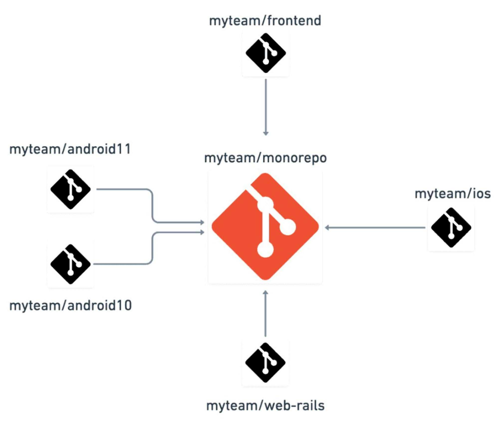
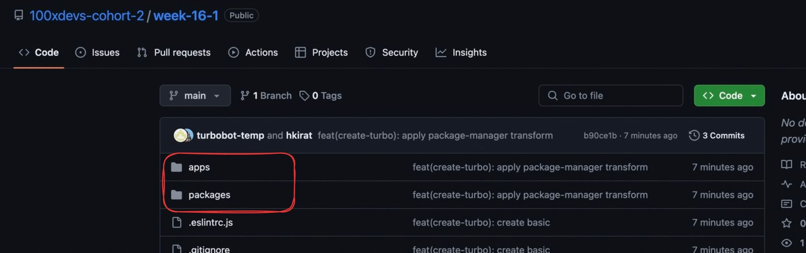
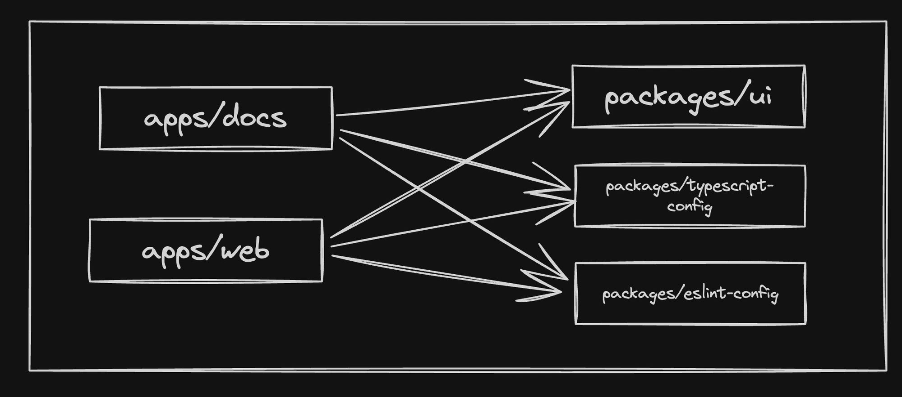

# Week 16.1 | Monorepos

## Contents: 
- [**What are monorepos**](#what-are-monorepos)
- [**Examples of Monorepos**](#examples-of-monorepos)
- [**Why Monorepos**](#why-monorepos)
- [**Importance for Full Stack Engineers**](#importance-for-full-stack-engineers)
- [**Common monorepo framework in Node.js**](#common-monorepo-framework-in-nodejs)
- [**Build system vs Build system orchestrator vs Monorepo framework**](#build-system-vs-build-system-orchestrator-vs-monorepo-framework)
- [**Turborepo**](#turborepo)
- [**Let’s initialize a simple Turborepo**](#lets-initialize-a-simple-turborepo)
- [**Explore the folder structure**](#explore-the-folder-structure)
- [**Let’s try to run the project**](#lets-try-to-run-the-project)


### What are monorepos
**Monorepos**, short for **monolithic repositories**, are a type of software development strategy where all source code for multiple projects or components is stored within *a single version control repository*. This is in contrast to the more traditional approach where each project or component is maintained in its own separate repository (often referred to as a "**polyrepo**" approach).

In a monorepo structure, you'll typically find directories for different parts of the application, such as:
``` bash
monorepo/
  ├── frontend/
  │   ├── web-app/
  │   └── mobile-app/
  ├── backend/
  │   ├── api-server/
  │   └── database/
  ├── devops/
  │   ├── ci-cd/
  │   └── infrastructure/
  └── shared/
      ├── utils/
      └── components/
```

This structure allows for a centralized location where all the code related to a project or organization can be stored, versioned, and managed together.

### Examples of Monorepos
Several popular open-source projects and companies adopt the monorepo approach. Here are a couple of examples:

1. [**Daily Code**](https://github.com/code100x/daily-code):
This repository contains code for a daily coding challenge website. It includes both the frontend and backend code in a single repository.


2. [**Cal.com**](https://github.com/calcom/cal.com):
Cal.com is an open-source scheduling platform. Their monorepo contains the code for the web application, backend services, and various integrations.


### Why Monorepos
**Monorepos** are chosen by some organizations for various reasons, each with its own set of advantages. Here are some of the key reasons why companies might opt for a monorepo strategy:
1. **Atomic Changes:** Monorepos allow for atomic commits across multiple projects. This means that changes that affect multiple parts of the codebase can be submitted, reviewed, and merged as a single unit, ensuring consistency and reducing the risk of integration issues.
2. **Simplified Code Sharing:** Sharing code between different projects is easier in a monorepo because there's no need to manage and sync multiple repositories. This can lead to more efficient code reuse and a more consistent codebase.
3. **Streamlined Dependency Management:** With all code in one place, it's simpler to manage dependencies between different projects. This can reduce the overhead of maintaining multiple versions of the same dependency and make it easier to enforce consistent use of libraries and frameworks.
4. **Centralized Governance:** A monorepo provides a single point for enforcing coding standards, policies, and best practices. This can lead to a more uniform codebase and can help ensure that all projects adhere to the same quality and security standards.
5. **Enhanced Collaboration:** Monorepos can encourage collaboration across different teams, as it's easier to see how changes in one project might affect others. This can lead to better coordination and a shared sense of ownership of the codebase.
6. **Simplified Refactoring and Large-Scale Changes:** Making large-scale changes across the codebase is more straightforward in a monorepo because all the code is in one place. This can facilitate large refactoring efforts and help keep the codebase modern and maintainable.
7. **Easier Onboarding:** New developers can more easily understand the relationships between different projects and components when they are all stored in a single repository. This can speed up the onboarding process and help new team members become productive more quickly.
8. **Scalable Infrastructure:** Large organizations with the resources to invest in custom tooling can build infrastructure that scales with the size of the monorepo. This includes build systems, CI/CD pipelines, and code review tools that are optimized for handling large volumes of code and frequent changes.
9. **Reduced Duplication:** Monorepos can help reduce duplication of code and effort by making it easier to find existing solutions within the codebase before implementing something new.
10. **Historical Context:** Having all code in one repository provides a comprehensive history of changes across all projects. This can be invaluable for understanding how the codebase has evolved and for tracking down the origins of certain decisions or features.


Despite these advantages, monorepos also come with challenges, such as the need for specialized tooling to handle large repositories, potential performance issues, and the complexity of managing a single massive codebase. The decision to use a monorepo should be based on the specific needs, constraints, and capabilities of the organization.


### Importance for Full Stack Engineers
As a full stack engineer, it's not essential to have in-depth knowledge of setting up and managing monorepos from scratch. In most cases, the monorepo structure is already established by the development tools team or the project's initial setup.

However, it's beneficial to understand the best practices and conventions used within a monorepo. This includes:
- Understanding the directory structure and where to locate specific components or modules.
- Following the established coding standards and guidelines for the project.
Utilizing the shared libraries and utilities effectively to maintain consistency - across the codebase.
- Collaborating with other team members and working within the monorepo workflow.

While setting up a monorepo from scratch is not a common task for most full stack engineers, it's still valuable to have a general understanding of how monorepos work and their benefits.


### Common monorepo framework in Node.js
1. [**Lerna**](https://lerna.js.org)
    Lerna is a popular tool for managing JavaScript monorepos. It provides features like package management, versioning, and publishing. With Lerna, you can easily manage dependencies, run scripts across multiple packages, and publish packages to npm.
2. [**NX**](https://github.com/nrwlnx)
    Nx is a powerful monorepo tool and build system developed by Nrwl. It offers a wide range of features, including code generation, dependency management, and advanced build optimization. Nx supports various frontend and backend frameworks, making it a versatile choice for monorepo development.
3. [**Turborepo**](https://turbo.build)
    Turborepo is a high-performance build system for JavaScript and TypeScript codebases. While not strictly a monorepo framework, it provides powerful features for managing and optimizing monorepo builds. Turborepo focuses on fast incremental builds, caching, and efficient task execution.
4. [**YARN/NPM workspaces**](https://classic.yarnpkg.com/lang/en/docs/workspace)
    Yarn and npm both provide built-in support for workspaces, which allow you to manage multiple packages within a single repository. Workspaces enable you to share dependencies across packages and link them together for development purposes.


### Build system vs Build system orchestrator vs Monorepo framework
Build systems, build system orchestrators, and monorepo frameworks are all tools or concepts related to software development, but they serve different purposes and operate at different levels of abstraction. Let's define each term and see how they relate to each other:

1. **Build System**
**Build system** automates the process of transforming source code written by developers into binary code that can be executed by a computer. In the context of JavaScript and TypeScript projects, a build system performs tasks such as:
Transpilation: Converting TypeScript code to JavaScript code.
- **Bundling:** Combining multiple JavaScript files into a single file or a smaller set of files to optimize loading and execution.
- **Minification:** Reducing the size of JavaScript files by removing unnecessary characters and optimizing the code.
- **Testing:** Running automated tests to ensure the correctness and reliability of the code.
- **Linting:** Analyzing the code for potential errors, style inconsistencies, and adherence to coding standards.
- **Deployment:** Preparing the built code for deployment to a production environment.
Examples of popular build systems in the JavaScript ecosystem include **Webpack**, **Rollup**, **Parcel**, and **Vite**.

2. **Build System Orchestrator**
A **build system orchestrator**, like **Turborepo**, sits on top of the actual build systems and coordinates the execution of tasks across multiple packages or projects within a monorepo. Instead of directly performing tasks like transpilation or bundling, a build system orchestrator focuses on:

- **Task Definition:** Allowing developers to define tasks in a configuration file (e.g., `turbo.json`) that specify the commands to run for each task.
- **Task Orchestration:** Determining the order in which tasks should be executed based on their dependencies and optimizing the execution process.
- **Caching:** Intelligently caching the results of previous builds to speed up subsequent builds and avoid redundant work.
- **Parallel Execution:** Leveraging available system resources to run tasks in parallel, improving overall build performance.

Here's an example of how you might define tasks in a `turbo.json` file: 
``` json
{
  "$schema": "<https://turborepo.org/schema.json>",
  "pipeline": {
    "build": {
      "dependsOn": ["^build"],
      "outputs": ["dist/**"]
    },
    "test": {
      "dependsOn": ["build"],
      "outputs": []
    },
    "lint": {
      "outputs": []
    }
  }
}
```
In this example, the `build` task depends on the `build` tasks of its dependencies (indicated by `^build`), the `test` task depends on the `build` task, and the `lint` task has no dependencies. Turborepo will optimize the execution of these tasks based on their dependencies and cache the outputs for faster subsequent builds.

3. **Monrepo Framework**
A **monorepo framework** provides a set of tools and conventions for managing projects that contain multiple packages or applications within a single repository. It focuses on:

- **Dependency Management:** Handling dependencies between packages within the monorepo, ensuring that packages can reference and use each other correctly.
- **Workspace Configuration:** Providing a way to define and configure workspaces, which are separate packages or projects within the monorepo.
- **Shared Code:** Facilitating the sharing of common code, utilities, and configurations across packages within the monorepo.
- **Versioning:** Managing the versioning of packages within the monorepo, often using a unified versioning scheme.

Examples of monorepo frameworks include Lerna, Nx, and Rush.

Here's an example of a monorepo structure using Lerna:

``` bash
monorepo/
  ├── packages/
  │   ├── package-a/
  │   │   ├── src/
  │   │   ├── package.json
  │   │   └── tsconfig.json
  │   └── package-b/
  │       ├── src/
  │       ├── package.json
  │       └── tsconfig.json
  ├── package.json
  └── lerna.json
```

In this structure, the `packages` directory contains individual packages (`package-a` and `package-b`), each with its own `package.json` and source code. The root `package.json` and `lerna.json` files configure the monorepo and define the workspaces.

### Relationship between all 3
These three concepts are related but serve different purposes:
- A **build system** focuses on the actual transformation and processing of source code into executable code.
- A **build system orchestrator** sits on top of build systems and coordinates the execution of tasks across multiple packages or projects within a monorepo.
- A **monorepo framework** provides the structure, conventions, and tools for managing multiple packages or projects within a single repository.

**Note:** In a typical monorepo setup, you might use a monorepo framework like Lerna to manage the overall structure and dependencies, a build system orchestrator like Turborepo to optimize and coordinate the execution of tasks, and individual build systems like Webpack or Vite to perform the actual code transformation and bundling.

### Turborepo
**Turborepo** is a high-performance build system for JavaScript and TypeScript monorepos. It is designed to make it easier to manage and build multiple packages or applications within a single repository. **Turborepo** aims to optimize the developer experience by providing features that speed up the development process, such as caching, parallel execution, and remote caching with **Turborepo**'s Cloud service.


### Monrepo Vs Turborepo
Monorepos and Turborepo are related but distinct concepts. Let's clarify the differences:

#### Monorepo
- A monorepo is an architectural approach where multiple projects or packages are stored and managed within a single repository.
- Monorepos provide benefits such as code sharing, simplified dependency management, and unified versioning across projects.
- Monorepo tools like Lerna, Nx, and Yarn/npm workspaces help manage and orchestrate the monorepo structure, including package management, script execution, and publishing.
- Monorepos can be used with various build systems and tools, not limited to Turborepo


#### Turborepo
- Turborepo is a specific build system and task runner designed for high-performance builds in monorepo setups.
- It focuses on optimizing build times, caching, and efficient execution of tasks across multiple packages.
- Turborepo leverages a smart scheduling algorithm to determine the optimal order of task execution based on package dependencies.
- It provides features like remote caching, incremental builds, and parallel execution to speed up the development workflow.
- While Turborepo is commonly used in monorepo setups, it can also be used in multi-repo setups where fast and efficient builds are desired.


### Let’s initialize a simple Turborepo
**Note:** for reference go to tuborepo [docs](https://turbo.build/repo/docs)

1. Initialize a Turborepo
```bash
npx create-turbo@latest
```
2. Select `npm workspaces` as the monorepo framework.

By the end, you will notice a folder structure that looks like this -


### Explore the folder structure
There are 5 modules in our project:

- End user apps (Websites / Core Backend)
    1. `apps/web` - A next.js website
    2. `apps/docs` - A docs website that has all the documentation related to your project.

- Helper packages
    1. `packages/ui` - UI packages
    2. `packages/typescript-config` - Shareable TS Configuration
    3. `packages/eslint-config` - Shareable ESLint configuration




### Let’s try to run the project
In the root folder, run
``` bash
npm run dev
```
You will notice two websites running on
1. `localhost:3000`
2. `localhost:3001`

This means we have a single `repo` which has multiple `projects` which share code from `packages/ui`.