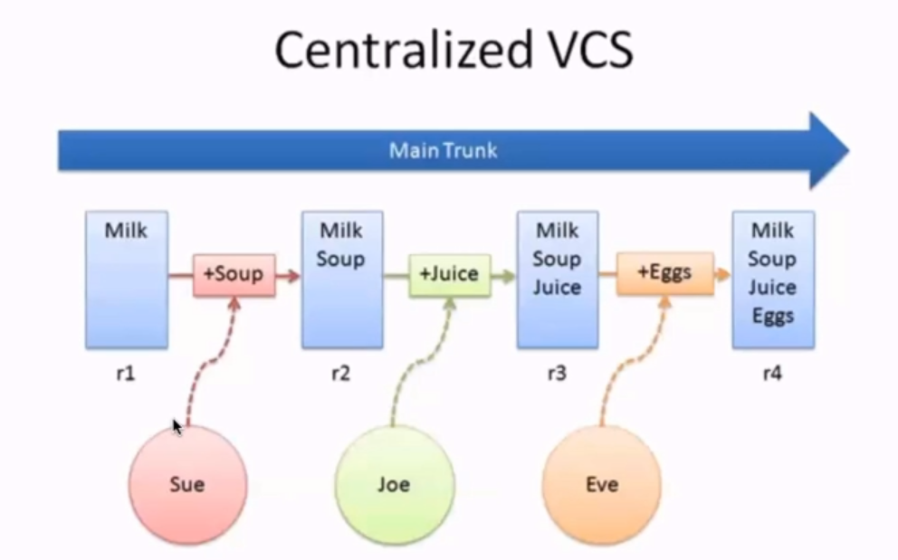
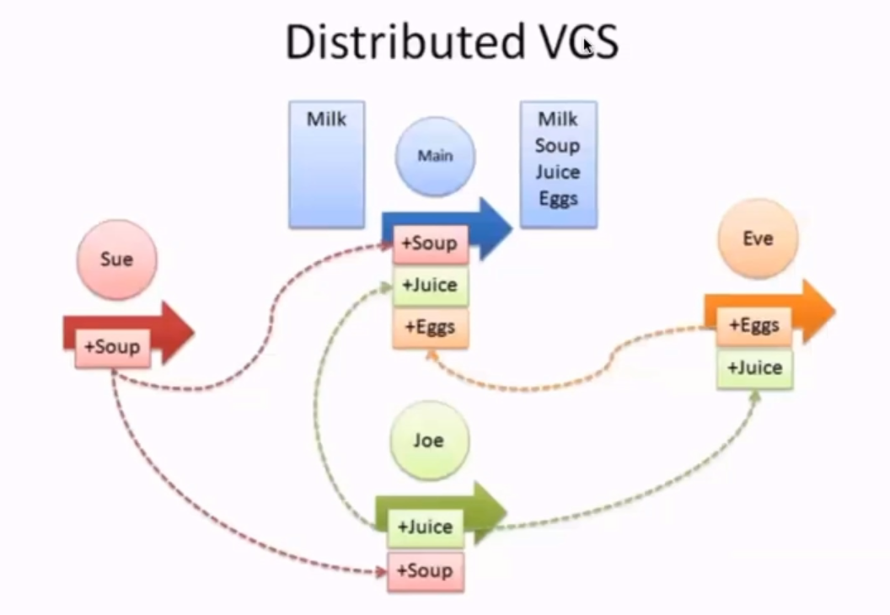
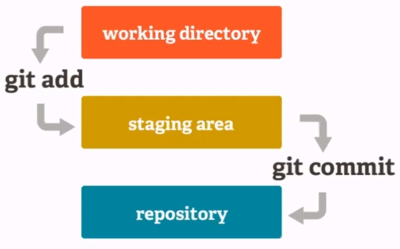

# Git/Github

#### What is version control system?
- A system that keep track of our files or projects.
- it allows you to revert selected files to a previous state, revert the entire project to a previous state, compare changes over time, see who last modified someting so that we can know what might be causing a problem or what is the issue, who made it, and when with the details.

#### Types of Version Control Systems (VCS)
- There are 2 types VCS:
    1. Centralized Version Control 
        
        - Helps us backup, track and synchronize files
        - Keeps a single copy of the project.
        - the major drawback for this is common point failure, if the server is down no will be able to access the repositories.
        - It good with smaller teams working on smaller projects
        - examples: Subversion, Team Foundation Server
    2. Distributed Version Control ()
        
        - Each person working on the project has a copy of the project along with its history available within there machine.
        - Even if the main server goes down we can restore the repository from any of the team members.
        - In Distributed Version Control, the server doesn't have to online everytime to make changes, we can keep pushing the code to local copy of the repository we have push to the main repository whenever it is online and other members in the team can the pull the change made.
        - examples: Git, Mercurial

#### Git
- Git is free and open source version control system.
- It is scalable, super fast and cheap branching and merging.

#### What is Github?
- Github is a web-based hosting service for igt repositories.
- We can use git without github, but not vise versa.

|                    Git                        |                 Github                         |
|-----------------------------------------------|------------------------------------------------|
| Used for Version Control.                     | Used for hosting Git Repositories.             |
| Installed locally on Computer.                | Cloud based.                                   |
| Tracks changes made to a file.                | Provides a web interface to view file changes. |

#### Some common terminologies related to git and github
- **Local Repository**
    - Every VCS tool provides a private workplace as a working copy.
    - Developers makes changes in their private workplace and after commit, these changes becomes a part of the repository.
    - Git takes it one step further by providing them a private copy of the whole repository.
    - Users can perform many operations with this repository such as add file, remove file, rename file, move file commit changes and many more.
- **Working Directory and Staging Area or index**
    - An intermediate area where commit can be formatted and review before completing the commit.
- **push**
    - Send a change to another repository(may require permission).
- **pull**
    - Grab a change from a repository.

#### Basic workflow of Git
**Step 1** - Modify a file from the working directory.
**Step 2** - Add these files to the staging area.
**Step 3** - Perform commit operation that moves the files from the staging area. After push operation, it stores the change permenently to the Git repository. 


#### Terminologies
- **Blobs**
    - Blob stands from **B**inary **L**arge **O**bject.
    - Each version of a file is represented by blob.
    - A blob holds the file data but doesn't contain any metadata about the file.
    - It is a binary file and in Git database, it is named as SHA-1 hash of the file.
    - In Git, files are not addressed by names.
    - Everything is content-addressed.
- **Trees**
    - Tree is an object which represents a directory.
    - it holds blobs as well as other sub-directories.
    - A tree is a binary file that stores references to blobs and trees which are also named as SHA-1 hash of the tree object.
- **Commits**
    - Commit holds the current state of the repository. A commit is also named by SHA-1 hash.
    - Commit object = a node of the linked list.
    - Every commit object, you can traverse back by looking at the parent pointer to view the history of the commit.
    - If a commit has multiple parent commits, then that particular commit has been created by merging two branches.

#### Git commands
- **Clone** - Bring a repository hosted somewhere like github into a folder or your local machine.
    ``` bash
    git clone repository-link
    ```
- **Add** - track your files and changes in Git.
    ``` bash
    git add file-name
    ```
    **Note**: this add only the selected file to the staging area. if you want to add all modified files use the command below
    ``` bash
    git add .
    ```
- **Commit** - Save your files in Git.
    ``` bash
    git commit -m commit-message
    ```
- **Push** - Upload your commit to a git repository, like github.
    ``` bash
    git push
    ```
- **Commit** - Download changes from a remote repository to your local repository.
    ``` bash
    git pull
    ```
