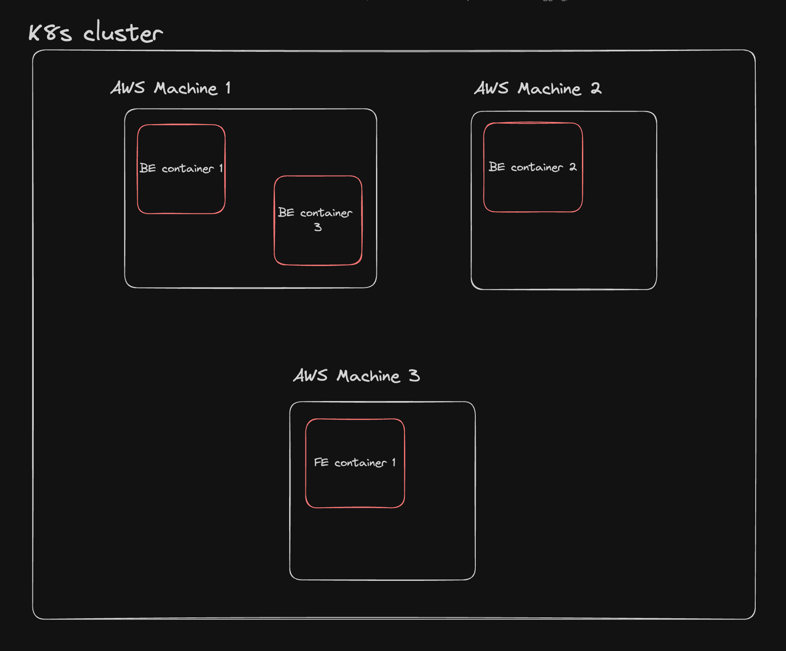
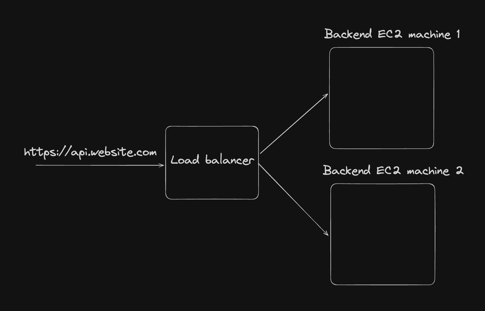
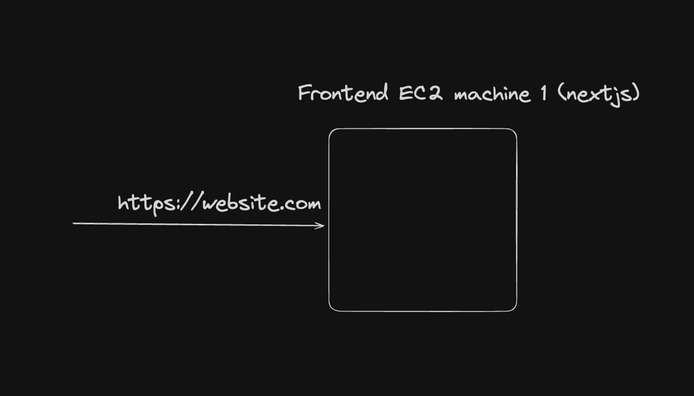
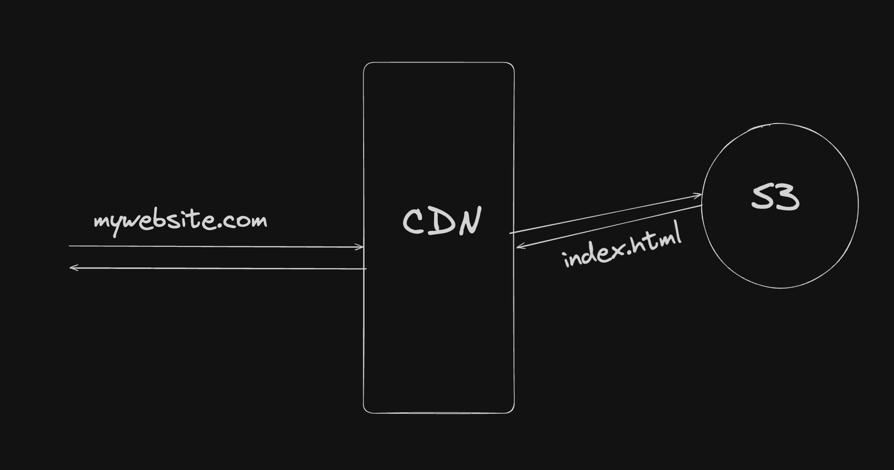
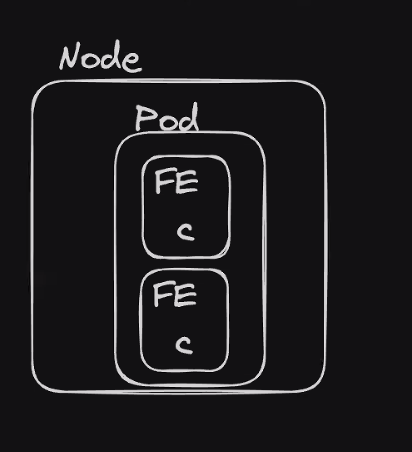
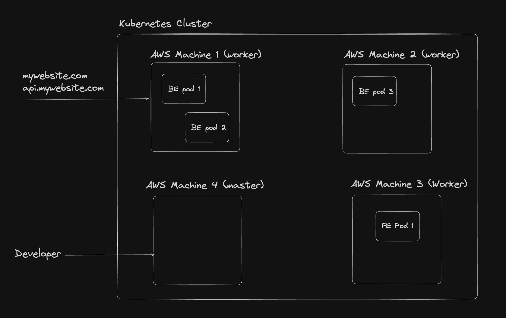
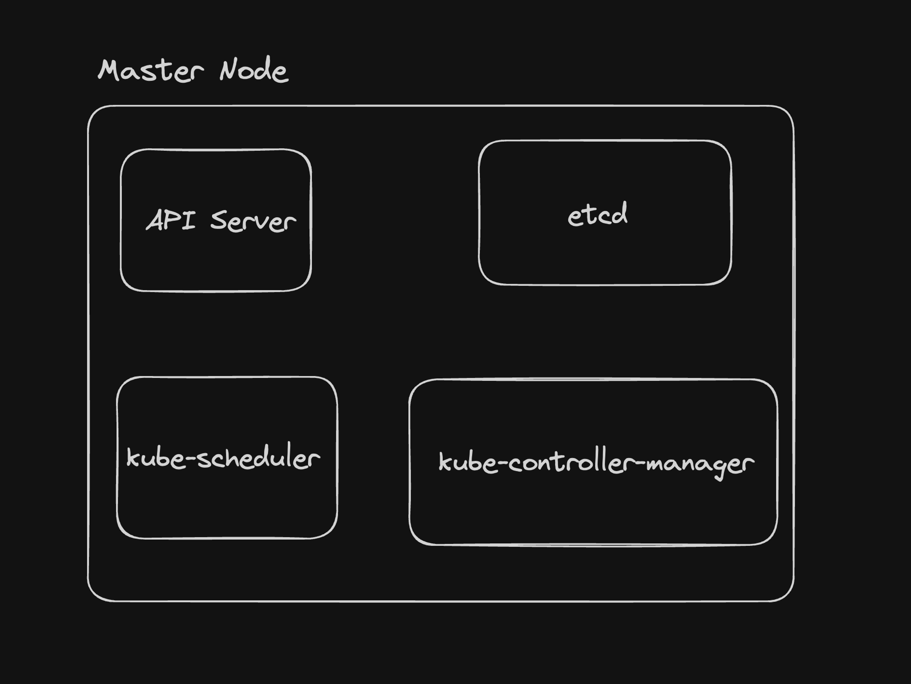
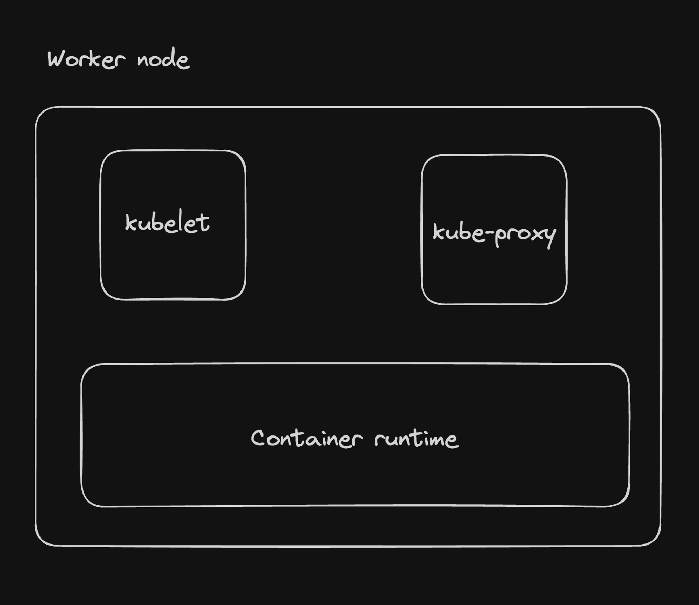

# Week 27.1 | Intro to kubernetes

## contents:
- [**What is kubernetes**](#what-is-kubernetes)
- [**Before kubernetes**](#before-kubernetes)
- [**After kubernetes**](#after-kubernetes)
    - [**Terminologies**](#terminologies)
        - [**Nodes**](#nodes)
            - [**Master Node**](#master-nodes-control-pane)

## What is kubernetes

- **Kubernetes** (popularly known as **k8s**) is a *container orchestration engine*, which as the name  suggests lets you create, delete, and update *containers*.
- This is useful when:
    - You have your docker images in the docker registry and want to deploy it in a cloud native fashion.
    - You want to not worry about patching, crashes. You want the system to auto heal.
    - You want to autoscale with some simple constructs.
    - You want to observe your complete system in a simple dashboard.

**Note:** **Kubernetes** is also known as **k8s**. **K_ _ _ _ _ _ _ _ s**

## Before kubernetes

## After kubernetes

Your frontend, backend are all pods in your kubernetes cluster.

Kuberetes cluster is bunch of machines(node).
a pod is smallest unit in which we can run container.
a single pod can run multiple container

a pod is an abstraction over a container.

### Terminologies
#### Nodes
- In kubernetes, you can create and connect various machines together, all of which are running `kubernetes`. Every machine here is known as a `node`
- There are two types of nodes:
    1. **Master Node (Control Pane):**  The node that takes care of deploying the containers/healing them/listening to the developer to understand what to deploy.
    2. **Worker Nodes:** The nodes that actually run your application (Backend/Frontend). Pods runs on worker nodes.
##### Master Nodes (Control Pane)
- Master node takes care of deploying the containers/healing them and listening to developer to understand what to deploy.
- 
- A master node consists of four components:
    1. **API Server:**
        - The API Server processes and responds to RESTful API requests from various clients, including the `kubectl` command line tool, other kubernetes components, and external applications.
        - These requests involves **creating**, **reading**, **updating** and **deleting** kubernetes resources such as pods, services and deployments.
        - The API Server **authenicates** and **authorizes** all API requests. It ensures that only authenticated and authorized users or components can perform actions on the cluster. This involves validating user credentials and checking access control policies.
        - The API Server exposes metrics and health check endpoints that can be used for monitoring and diagnosing the health and performance of the control pane.
        - The API server acts as the **central communications hub** for the kubernetes control pane. Other components, such as the **Scheduler**, **controller manager** and **kubelet**, interact with the API server to retrieve or update the state of the cluster.
    2. **ETCD:** **ETCD** is a **consistent** and **highly-available key value store** used as Kubernetes' backing store for all cluster data.
    3. **Kube Scheduler:**
        - It is a control pane component that **watches for newly created Pods** with no assigned nodes and selects a node for them to run on.
        - It is responsible for pod placement and deciding which pod goes on which node.
    4. **Kube Controller Manager:**
        - The **kube-controller-manager** is a component of the Kubernetes control plane that runs a set of controllers. 
        - Each controller is responsible for managing a specific aspect of the cluster's state.
        - There are many different types of controllers. Some examples of them are:
            - **Node Controller:** Responsible for noticing and responding when nodes go down.
            - **Deployment Controller:** Watches for newly created or updated deployments and manages the creation and updating of RelpicaSets based on the deployment specifications. It ensures that the desired state of the deployment is maintained by creating or scaling ReplicaSets as needed.
            - **ReplicaSet Controller:** Wataches for newly created or updated ReplicaSets and ensures that the desired number of pods replicas are running at any given time. It creates or deletes pods as necessary to maintain the specified number of replicas in the RelplciaSet's configuration.

##### Worker Nodes
- The worker nodes actually runs the pods. 
- 
- It consists of three components:
    1. **Kubelet:** 
        - Kubelet is an agent that runs on each node in the cluster.
        - It makes sure that containers are running in a Pod.