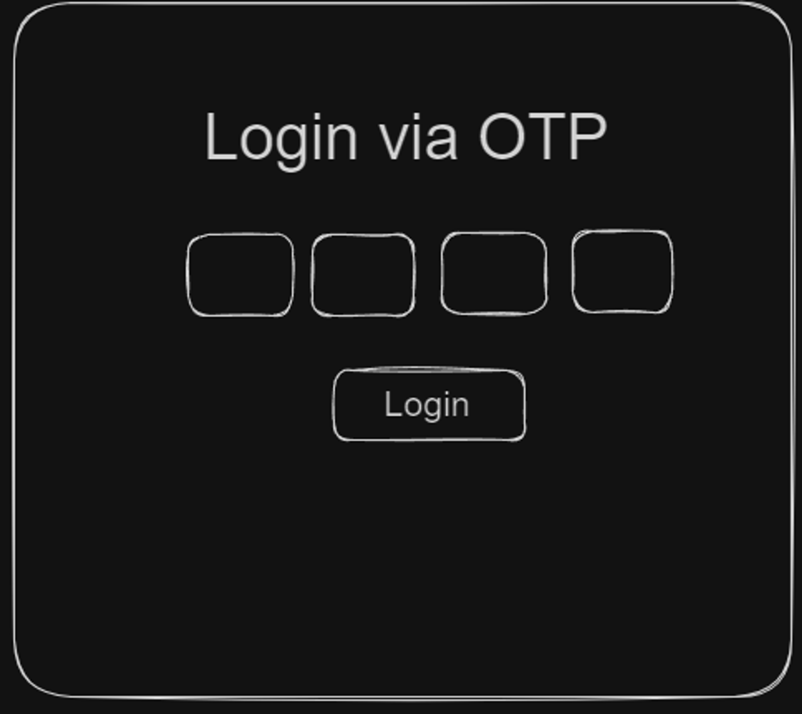

# React Problems - 100xdevs

#### Question 1: Create a Profile component in ReactJS.

#### Question 2: Create a background changer in ReactJS.

#### Question 3: Create your custom React using JS and render anchor tag.
**Hint**: In React we have a root element, here you have to create a HTML element and using JS render anchor tag.
1. Create an object for React element that has HTML anchor data.
2. Create a function that generates HTML code from reactElement and returns the final HTML tag.
3. Create a function customRender that takes in the object and the path of HTML where it will be rendered.

#### Question 4: Create a paragraph generator which takes length of words in paragraph and generate paragraph.

#### Question 5: Using GitHub API, render your Github information as your GitHub Info Card.
**Hint**: https://api.github.com/users/${username}

#### Question 6: Create a OTP login in ReactJS.
**Hint**: You have seen login via OTP on some sort of site like: HotStar etc. You have to build that. Here is the basics Prototype/design.

**Note**: Suppose that if user enter first digit of OTP, so cursor will automatically jump to the second digit.

#### Question 7: Create a birthday wisher site which take a name of a person and render 2-3 Birthday wish cards.
