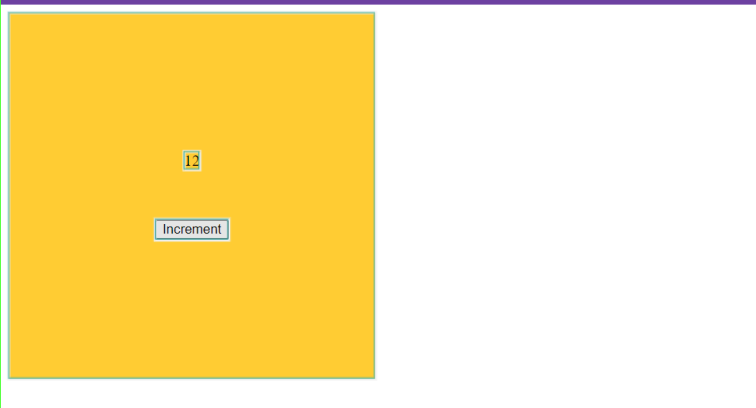
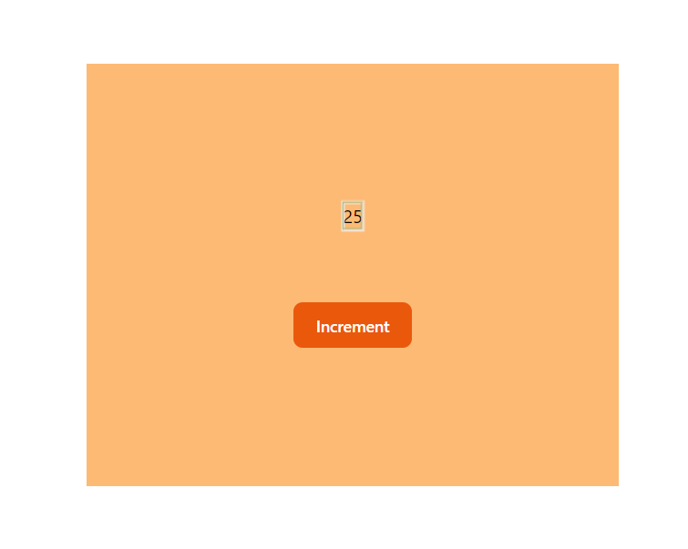

Week 7.2 | Context, State Management, Recoil

### Contents
- **Context API reacap**
- **State Management**
- **Recoil**

### Why do we use the Context API?
**Context API** is a powerful tool for managing state at the component level and facilitating the sharing of data between components without having to pass props through every level of the component tree. However, there are some limitations to the Context API that have led developers to explore other state management solutions. 
1. **Performance Concerns**:
    - **Context API Issue**: Changes in the context value trigger a re-render for all components subscribed to that context, regardless of whether they depend on the changed data.
    - **Alternative Solution**: Libraries like Redux, Recoil often use a more granular approach to state updates. Components can subscribe to specific parts of the state, reducing unnecessary renders.
2. **Complexity with Large Apps**:
    - **Context API Issue**: As an application grows, managing complex state logic solely with the Context API can become unwieldy.
    - **Alternative Solution**: Libraries like Redux provide a clear structure for managing global state. Actions, reducers, and middleware can help organize code and separate concerns in a scalable way.
3. **DevTools Support**:
    - **Context API Issue**: DevTools support for inspecting and debugging context-based state can be limited.
    - **Alternative Solution**: State management libraries like Redux often come with powerful DevTools that make it easier to trace state changes, inspect actions, and debug the application's state.

Here, an example show the issue with context API:
 ``` jsx
import { createContext } from 'react'

export const CountContext = createContext(0)
```
``` jsx
import { useContext, useState } from 'react'
import { CountContext } from './context'

const App = () => {
    const [count, setCount] = useState(0)
    return (
        <CountContext.Provider value={count}>
            <Count setCount={setCount} />
        </CountContext.Provider>
    )
}

const Count = ({ setCount }) => {
    return (
        <div
            style={{
                background: '#fc3',
                height: '50vh',
                width: '50vh',
                display: 'flex',
                flexDirection: 'column',
                gap: '50px',
                alignItems: 'center',
                justifyContent: 'center',
            }}>
            <CounterRenderer />
            <Button setCount={setCount} />
        </div>
    )
}

const CounterRenderer = () => {
    const count = useContext(CountContext)
    return <div> {count} </div>
}

const Button = ({ setCount }) => {
    return (
        <button type='button' onClick={() => setCount((prev) => prev + 1)}>
            {' '}
            Increment{' '}
        </button>
    )
}

export default App
```

Take a look at the image here we can see clearly that the Count component is getting re-rendered even if it does have any state inside it.

### State Management in React
In React, state management refers to the process of handling and controlling the data within a component or the entire application. The state represents the current condition or values that can change over time as a result of user interactions, API calls, or other events. Effective state management is crucial for building dynamic and interactive user interfaces.

## State Management using Recoil
#### Things to learn:
- **Recoil Root**
- **Atom**
- **useRecoilState**
- **useRecoilValue**
- **useSetRecoilState**
- **selector**

#### RecoilRoot
- **RecoilRoot** provies the context in which atoms have values.
- It must be an ancestor of any components that uses any Recoil hooks.

    ```jsx
    import {RecoilRoot} from 'recoil'

    const App = () => {
        return (
            <RecoilRoot>
                <ComponentThatUsesRecoil />
            </RecoilRoot>
        )
    }
    ```

#### Atoms
- Atoms are unit of state.
- Atoms can be read from and written to from any component.
- they are updatable and subcribable: When an atom is updated, each subscribed component is re-rendered with the new value.
- Atoms can be used in place of React local component state.
- If the state atom is used in multiple componentsm all those components share their state.
- Atoms are created using the **atom** function:
    ``` jsx
    const countState = atom({
        key: 'countState',
        default: 0
    })
    ```
- The **atom()** function take a single argument which is an object. The object consist of mainly two key values:
    1. **key**: Atoms need a unique key, which is used for debugging, persistence, and for certain advanced APIs that lets us see a map of all atoms. It is an error for two atoms to have the same key.
    2. **default**: Like React component state, atom also have a default state value.

#### useRecoilState
- To read and write an atom from a component, we use a hook called **useRecoilState**.
- It is just like **useState**, but the state can be shared between components/
    ``` jsx
    const Button = () => {
        const [count, setCount] = useRecoilState(countAtom)
        const handleClick = () => setCount(count + 1)

        return (
            <button type='button' onClick={handleClick}>
                Increment
            </button>
        )
    }
    ```
- Clicking the button will increment the count by one.

#### useRecoilValue
- **useRecoilValue** hook returns the value of the given Recoil state.
- This hook will subscribe the component to re-render if there are changing in the Recoil state.
    ``` jsx
    import { useRecoilValue } from 'recoil'
    import { countAtom } from './store/atoms/count'
    
    const CounterRenderer = () => {
        const count = useRecoilValue(countAtom)
        return <div> {count} </div>
    }
    ```

#### useSetRecoilState
- **useSetRecoilState** hook returns a setter function for updating the value of the writable Recoil state.
- The setter function which can be used asynchronously to change the state.

    ``` jsx
    import { RecoilRoot, useRecoilValue, useSetRecoilState } from 'recoil'
    import { countAtom } from './store/atoms/count'

    const Button = () => {
        const setCount = useSetRecoilState(countAtom)
        const handleClick = () => setCount((prev) => prev + 1)

        return (
            <button type='button' onClick={handleClick}>
                Increment
            </button>
        )
    }
    ```
- Clicking the button will increment the count by one.

#### Selector
- Selectors represent a function, or derived state in Recoil.
- It is similar to a pure function without any side-effects that always returns the same value for a given set of dependency values.
- If only a get function is provided, the selector is read-only and returns a RecoilValueReadOnly object. 
- If a set is also provided, it returns a writeable RecoilState object.
```js
import { atom, selector } from 'recoil'

export const countAtom = atom({
	key: 'countAtom',
	default: 0,
})

export const isEvenSelector = selector({
	key: 'evenSelector',
	get: ({ get }) => {
		const count = get(countAtom)
		return count % 2 === 0
	},
})
```
``` jsx
const EvenCountRenderer = () => {
	const isEven = useRecoilValue(isEvenSelector)
	return <div>{isEven ? <p> count is even </p> : null}</div>
}

export default EvenCountRenderer
```

Here, take a look only the counter component is getting re-rendered and not the whole app.