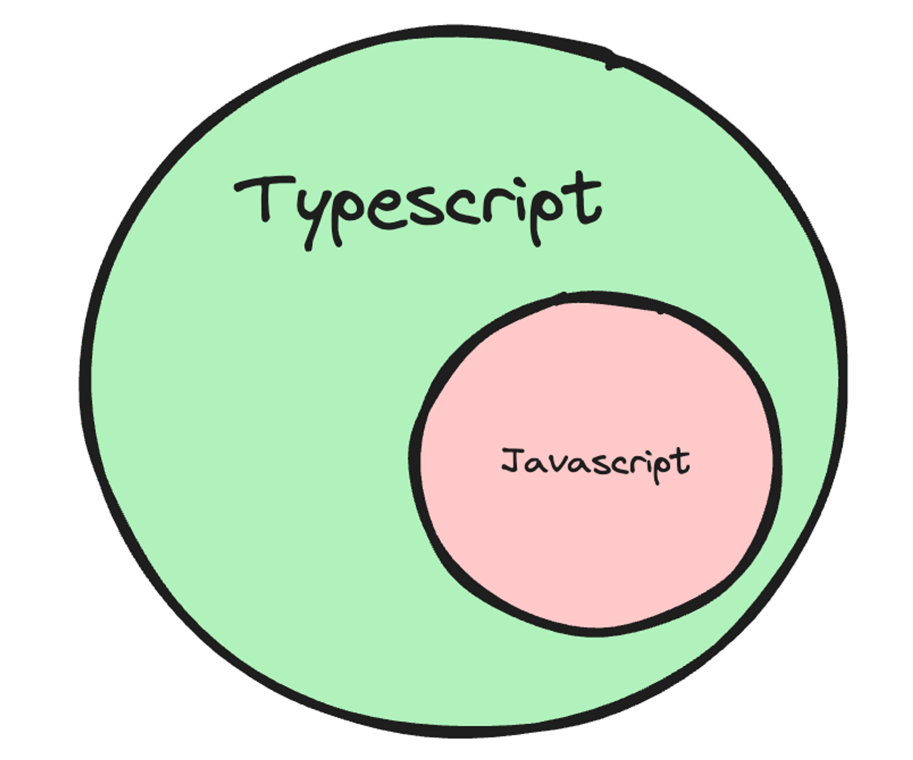
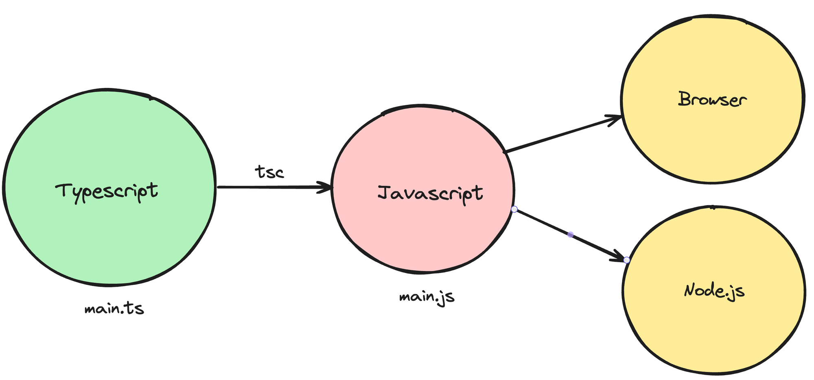
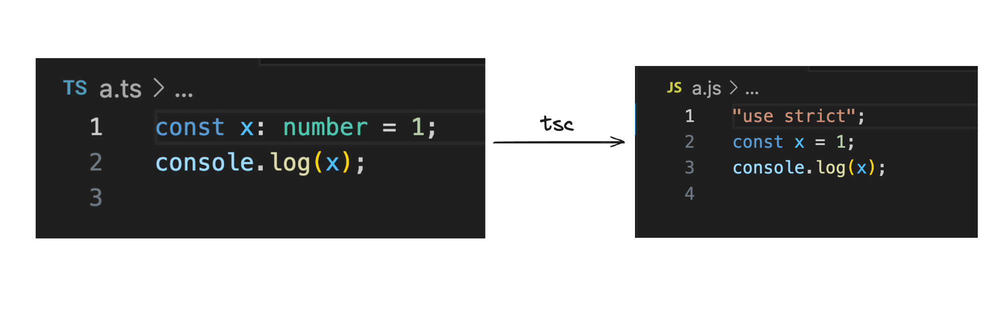
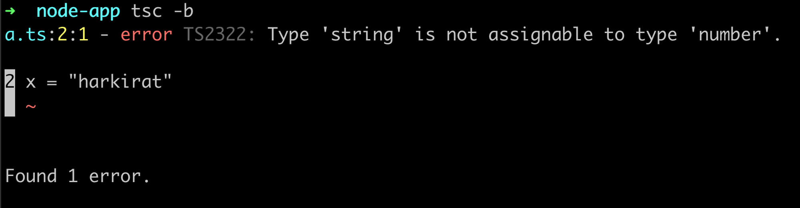

# Week 9.2 | Typescript

### Contents
- **Types of Languages (Strongly typed vs loosely typed)**
- **Typescript**
    - **What is Typescript?**
    - **Where/How does typescript code run?**
    - **Typescript compiler**
- **The TSC compiler**
- **Basic Types in Typescript**
    - **Problem 1**
    - **Problem 2**
    - **Problem 3**
    - **Problem 4**
- **The ```tsconfig``` file**
- **Interfaces**
    - **Implementing interfaces**
- **Types**
    - **Features of Types**
- **Interface vs Type**
    - **When to use which**
- **Arrays in TS**

### Types of Languages (Strongly typed vs loosely typed)
- The terms **strongly typed** and **loosely typed** refer to how programming languages handle types, particularly how strict they are about type conversions and type safety.

| Strongly Typed                            | Loosely Typed                             |
|-------------------------------------------|-------------------------------------------|
| Variables have a fixed type               | Variables can be change types             |
| Type checking is enforced at compile-time | Type checking is enforeced at runtime     |
| Stricter codebase                         | Faster to bootstrap                       |
| Lesser runtime errors                     | high chances for run time errors          |
| Examples: C++, Java, Rust                 | Examples: Javascript, Python, Perl, php   |

### Typescript
#### What is Typescript?
- Typescript is a programming language developed and maintained by Microsoft.
- It is a **strict syntactical superset** of JavaScript and adds optional static typing to the language.


#### Where/How does typescript code run?
- Typescript code never runs in your browser. Your browser can only understand javascript. 
- Javascript is the runtime language (the thing that actually runs in your browser/nodejs runtime).
- Typescript is something that compiles down to javascript/
- When typescript is compiled down to javascript, you get type checking (similar to C++). If there is an error, the conversion to Javascript fails.


#### Typescript compiler
- **tsc** is the official typescript compiler that you can use to convert Typescript code into Javascript.
- There are many other famous compilers/transpilers for converting Typescript to Javascript. Some famous ones are - 
    - **esbuild**
    - **swc**

### The tsc compiler
Let’s bootstrap a simple Typescript Node.js application locally on our machines.
1.  -**Install tsc/typescript globally**
```bash 
npm install -g typescript
```
2. **Initialize an empty Node.js project with typescript**
``` bash
mkdir node-app
```
- These commands should initialize two files in your project

3. **Create a a.ts file**
```typescript
const x: number = 1;
console.log(x);
```
4. **Compile the ts file to js file**
```bash
tsc -b
```
5. **Explore the newly generated index.js file**

- Notice how there is no typescript code in the javascript file. It’s a plain old js file with no **types**.
6. **Delete a.js**
7. **Try assigning x to a string**
- Make sure you convert the const to let
```typescript
let x: number = 1;
x = "harkirat"
console.log(x);
```
8. **Try compiling the code again**
```bash 
tsc -b
```
- Notice all the errors you see in the console. This tells you there are type errors in your codebase.
- Also notice that no **index.js** is created anymore.

- This is the high level benefit of typescript. It lets you catch **type** errors at **compile time**.


### Basic Types in Typescript
- Typescript provides us with some basic types:
    - **number**
    - **string**
    - **boolean**
    - **null**
    - **undefined**

#### Problem 1
- **Aim**: How to give types to arguments of a function
- **Problem**: Write a function that greets a user given their first name.
- **Argument**: firstName
- **logs**: Hello {firstName} 
- **returns**: Doesn't return anything

```typescript
function greeting(firstName: string) {
    console.log(`Hello ${firstName}`)
}

greeting('Anoop')
```

#### Problem 2
- **Aim**: How to assign a return type to a function.
- **Problem**: Write a function that calculates the sum of two functions.
- **Argument**: num1, num2
- **returns**: sum
```typescript
function sum(num1: number, num2: number):number {
    return num1 + num2
}

console.log(sum(45, 54)) // 99
```
#### Problem 3
- **Aim**: Type inference
- **Problem**: Write a function that returns true or false based on if a user is 18+.
- **Arugment**: age
- **Returns**: true/false 
```typescript
function isLegal(age: number) {
    return age > 18
}

console.log(isLegal(2))
```
- **Type Inference**: Type inference in TypeScript refers to the ability of the compiler to automatically determine and assign data types to variables based on the value assigned to them. 

#### Problem 4
- **Problem**: Create a function that takes another function as input, and runs it after 1 second.
- **Arugment**: function
- **returns**: depends on the input function.

```typescript
function delayedCall(fn: () => void) {
    setTimeout(fn, 1000)
}

delayedCall(function() {
    console.log("hi there")
})
```

### The tsconfig file
- The tsconfig file has a bunch of options that we can change to change the compilation process.
- Some of these includes:
1. **target**
    - The **target** option in a **tsconfig.json** file specifies the ECMAScript target version to which the TypeScript compiler will compile the TypeScript code.
    - To try it out, try compiling the following code for target being **ES5** and **es2020**:
        ```typescript
        const greet = (name: string) => `Hello, ${name}!`
        ```
    - **Output in ES5**
        ```js
        "use strict";
        var greet = function (name) { return "Hello, ".concat(name, "!"); };
        ```
    - **Output in ES2020**
        ```js
        "use strict";
        const greet = (name) => `Hello, ${name}!`;
        ```
2. **rootDir**
    - The **rootDir** is the folder the compiler should look for ```.ts``` files.
    - A good practice is for this to be the **src** folder.
3. **outDir**
    - The **outDir** is the folder to look for spit out the **.js** files. 
4. **noImplicitAny**
    - the **noImplicitAny** compiler option is used to enforce stricter type checking by preventing the use of the any type implicitly.
     - When **noImplicitAny** is enabled, TypeScript will flag an error whenever it cannot infer a more specific type and would otherwise default to the any type.
5. **removeComments**
    - Weather or not to include comments in the final **js** file

### Interfaces
- In TypeScript, an **interface** is a way to define the structure of an object.
- It's a TypeScript-specific feature that helps in describing the shape of objects, including their properties and methods.
- Interfaces are purely a compile-time construct and do not generate any JavaScript code.
- **example:** Here, is a user object looks like - 
    ```js
    const user = {
        firstName: "harkirat",
        lastName: "singh",
        email: "email@gmail.com".
        age: 21,
    }
    ```
    To assign a type to the **user** object, we can use an **interface**
    ```ts
    interface User {
        firstName: string
        lastName: string
        age: number
        email?: string
    }

    const user = {
        firstName: 'harkirat',
        lastName: 'singh',
        email: 'email@gmail.com',
        age: 21,
    }

    function isLegal(user: User) {
        return user.age > 18
    }
    ```
#### Implementing Interfaces
- In typescript, we can **implement** interfaces as a class.
- Let’s say we have a person **interface** - 
``` ts
interface Person {
    name: string;
    age: number;
    greet(phrase: string): void;
}
```
- We can create a class which implements this interface.
``` ts
class Employee implements Person {
    name: string;
    age: number;

    constructor(n: string, a: number) {
        this.name = n;
        this.age = a;
    }

    greet(phrase: string) {
        console.log(`${phrase} ${this.name}`);
    }
}
```
- This is useful since now we can create multiple variants of a person (Manager, CEO …)

### Types
- In TypeScript, **types** allow us to aggregate data together in a manner very similar to interfaces. They provide a way to define the structure of an object, similar to how interfaces do.
```ts
type User = {
    firstName: string;
	lastName: string;
	age: number
}
```
#### Features of Type
1. **Unions**
    - Unions allow us to define a type that can be one of several types. This is useful when dealing with values that could have different types.
    - For instance, imagine we want to print the ID of a user, which can be either a number or a string:
    ``` ts 
    type StringOrNumber = string | number;

    function printId(id: StringOrNumber) {
    console.log(`ID: ${id}`);
    }

    printId(101); // ID: 101
    printId("202"); // ID: 202
    ```
    - Unions provide flexibility in handling different types within a single type definition.
    - **Note:** We cannot do this with **interface**
2. **Intersection**
    - Intersections allow us to create a type that has every property of multiple **types** or **interfaces**. 
    - If we have types like **Employee** and **Manager**, and we want to create a **TeamLead** type that combines properties of both:
    ``` ts
    type Employee = {
        name: string;
        startDate: Date;
    };

    type Manager = {
        name: string;
        department: string;
    };

    type TeamLead = Employee & Manager;

    const teamLead: TeamLead = {
        name: "harkirat",
        startDate: new Date(),
        department: "Software developer"
    };
    ```
    - Intersections provide a way to create a new type that inherits properties from multiple existing types.
    - **Note:** We cannot do this with **interface**

- ### Interface vs Type

| Differences             | Interfaces              | Types                   |
|-------------------------|-------------------------|-------------------------|
| Declaration Syntax      | Uses the **type** keyword. <br/> More flexible syntax, can represent primitive types, unions, intersections, and more. | Uses the **interface** keyword. <br/> Typically used for defining the structure of objects. |
| Extension and Merging | Supports extending types. <br /> Can't be merged; if you define another type with the same name, it will override the previous one. | Supports extending **interfaces** using the extends keyword. <br /> Automatically merges with the same-name interfaces, combining their declarations. |
| Declaration vs. Implementation | Can represent any type, including primitives, unions, intersections, etc. <br />Suitable for describing the shape of data. | Mainly used for describing the shape of objects. <br /> Can also be used to define contracts for classes. |
| Type Overriding | Types cannot be overridden or merged. Redefining a type with the same name replaces the previous one. | Interfaces automatically merge if declared with the same name. |
| Object Literal Strictness | Types are more lenient when dealing with object literal assignments. | Interfaces enforce strict object literal shapes. |
| Implementation for Classes | Interfaces can be used to define contracts for class implementations. |Types are more versatile for creating complex types and reusable utility types. |

#### When to use which
- **use Type:**
    - For advanced scenarios requiring union types, intersections, or mapped types.
    - When dealing with primitive types, tuples, or non-object-related types.
    - Creating utility types using advanced features like conditional types.
- **Use Interfaces:**
    - When defining the structure of objects or contracts for class implementations.
    - Extending or implementing other interfaces.
    - When consistency in object shape is a priority.

### Arrays in TS
- If we want to access arrays in typescript, it’s as simple as adding a **[]** annotation next to the type.
#### Example 1
- Given an array of positive integers as input, return the maximum value in the array.
```ts
function maxValue(arr: number[]) {
    let max = 0;
    for (let i = 0; i < arr.length; i++) {
        if (arr[i] > max) {
            max = arr[i]
        }
    }
    return max;
}

console.log(maxValue([1, 2, 3]));
```
#### Example 2 
Given a list of users, filter out the users that are legal (greater than 18 years of age).
```ts
interface User {
	firstName: string;
	lastName: string;
	age: number;
}

function filteredUsers(users: User[]) {
    return users.filter(x => x.age >= 18);
}

console.log(filteredUsers([{
    firstName: "harkirat",
    lastName: "Singh",
    age: 21
}, {
    firstName: "Raman",
    lastName: "Singh",
    age: 16
}, ]));
```