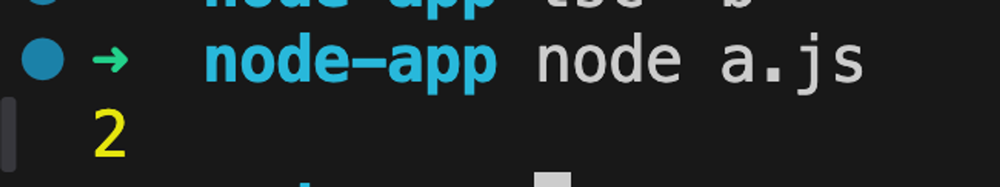

# Week 9.3 - Generics, enums, imports & exports

### Contents: 
- **Enums**
- **Generics**
- **Exporting and importing modules**


### Enums
- Enums (short for enumerations) in TypeScript are a feature that allows you to define a set of named constants.
- The concept behind an enumeration is to create a human-readable way to represent a set of constant values, which might otherwise be represented as numbers or strings.
#### Example 1
- Let’s say we have a game where you have to perform an action based on weather the user has pressed the up arrow key, down arrow key, left arrow key or right arrow key.
```js
function doSomething(keyPressed) {
	// do something.
}
```
What should the type of keyPressed be?
Should it be a string? (UP , DOWN , LEFT, RIGHT) ?
Should it be numbers? (1, 2, 3, 4) ?

The best thing to use in such a case is an enum.
```ts
enum Direction {
    Up,
    Down,
    Left,
    Right
}

function doSomething(keyPressed: Direction) {
	// do something.
}

doSomething(Direction.Up)
```

##### What values do you see at runtime for Direction.UP ?
```ts
enum Direction {
    Up,
    Down,
    Left,
    Right
}

function doSomething(keyPressed: Direction) {
	// do something.
}

doSomething(Direction.Up)
console.log(Direction.Up)
```

This tells you that by default, enums get values as 0 , 1, 2...

#####  How to change values?
``` ts
enum Direction {
    Up = 1,
    Down, // becomes 2 by default
    Left, // becomes 3
    Right // becomes 4
}

function doSomething(keyPressed: Direction) {
	// do something.
}

doSomething(Direction.Down)
```


##### Can also be strings
```ts
enum Direction {
    Up = "UP",
    Down = "Down",
    Left = "Left",
    Right = 'Right'
}

function doSomething(keyPressed: Direction) {
	// do something.
}

doSomething(Direction.Down)
```
##### Common usecase in express
```ts
enum ResponseStatus {
    Success = 200,
    NotFound = 404,
    Error = 500
}

app.get("/', (req, res) => {
    if (!req.query.userId) {
			res.status(ResponseStatus.Error).json({})
    }
    // and so on...
		res.status(ResponseStatus.Success).json({});
})
```